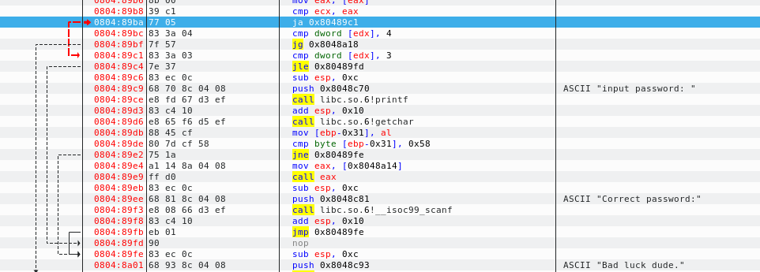
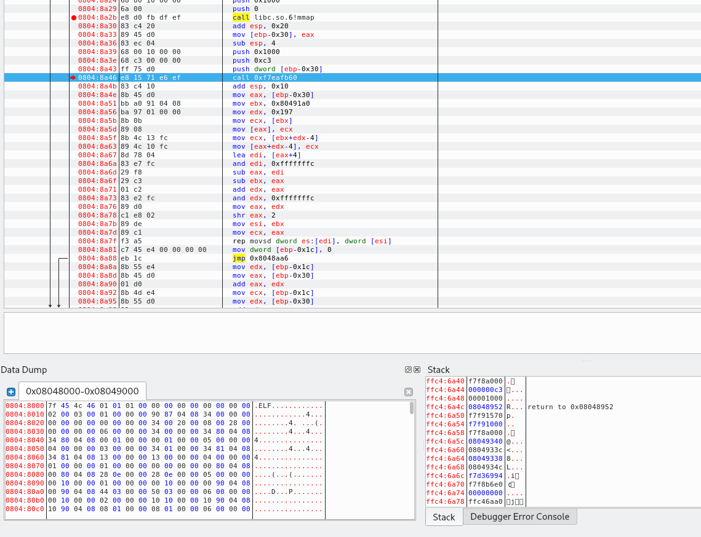

```
Can you find the password?  
Enter the password as flag in the following form: HTB{passwordhere}
```

==> For this challenge we get a single executable file:

```bash
file BombsLanded 
BombsLanded: ELF 32-bit LSB executable, Intel 80386, version 1 (SYSV), for GNU/Linux 2.6.32, BuildID[sha1]=53d6c985990fd9b8ed4f1caf10ce7d64e14b2121, dynamically linked, interpreter /lib/ld-linux.so.2, no section header
```

we see that the `strings` command returns very little information just like executing the file:

```bash
./BombsLanded 
Bad luck dude.
```

so we can go on and fire up `ghidra` --> we get the following `main`function:

```c#

/* WARNING: Function: __i686.get_pc_thunk.bx replaced with injection: get_pc_thunk_bx */
/* WARNING: Globals starting with '_' overlap smaller symbols at the same address */

undefined4 main(int param_1)

{
  int iVar1;
  undefined4 *__s;
  uint uVar2;
  undefined4 *puVar3;
  undefined4 *puVar4;
  byte bVar5;
  uint local_24;
  
  bVar5 = 0;
  _DAT_10091348 = &__DT_PLTGOT;
  _DAT_1009134c = _DAT_1009134c + 1;
  _DAT_10091338 = _DAT_10091338 + -1;
  _DAT_1009133c = _DAT_1009133c + 1;
  _DAT_10091340 = _DAT_10091340 + -1;
  if ((_DAT_1009134c <= _DAT_1009133c) && (4 < param_1)) {
    __s = (undefined4 *)mmap((void *)0x0,0x1000,7,0x22,-1,0);
    memset(__s,0xc3,0x1000);
    *__s = _DAT_100911a0;
    *(undefined4 *)((int)__s + 0x193) = _DAT_10091333;
    iVar1 = (int)__s - (int)(undefined4 *)((uint)(__s + 1) & 0xfffffffc);
    puVar3 = (undefined4 *)(&DAT_100911a0 + -iVar1);
    puVar4 = (undefined4 *)((uint)(__s + 1) & 0xfffffffc);
    for (uVar2 = iVar1 + 0x197U >> 2; uVar2 != 0; uVar2 = uVar2 - 1) {
      *puVar4 = *puVar3;
      puVar3 = puVar3 + (uint)bVar5 * -2 + 1;
      puVar4 = puVar4 + (uint)bVar5 * -2 + 1;
    }
    for (local_24 = 0; local_24 < 0x197; local_24 = local_24 + 1) {
      *(byte *)((int)__s + local_24) = *(byte *)((int)__s + local_24) ^ 99;
    }
    (*(code *)__s)();
    memset(__s,0,0x197);
                    /* WARNING: Subroutine does not return */
    exit(0);
  }
  if (3 < param_1) {
    printf((char *)0x10090c70);
    iVar1 = getchar();
    if ((char)iVar1 == 'X') {
      (*(code *)0xc3)();
      __isoc99_scanf(0x10090c81);
    }
  }
  puts((char *)0x10090c93);
  return 0;
}
```

and we see that a whole lot is happening in terms of obfuscation. From the last few lines

```c#
  if (3 < param_1) {
    printf((char *)0x10090c70);
    iVar1 = getchar();
    if ((char)iVar1 == 'X') {
      (*(code *)0xc3)();
      __isoc99_scanf(0x10090c81);
    }
  }
  puts((char *)0x10090c93);
```

we can assume that this is the part that is asking us for the password while the last line is the one printing `Bad luck dude.`. However, this part never seems to get executed and this is probably linked to the `param_1`variable.

==> To handle the standard input, run it using:

```bash
gnome-terminal -- edb --run ./BombsLanded
```

==> We can then open the file in `edb` to trace the execution --> we can go to the `main`address and we can get it from `Ghidra` and use:

```
CTRL + G --> Goto expression: 0x08048937
Add a breakpoint using F2
Run until the breakpoint at main
```

we can now get the address of the comparison from `ghidra`:

```c#
if ((_DAT_1009134c <= _DAT_1009133c) && (4 < param_1)) {
```

and it is: `0x080489ba` --> next go to this expression and add a breakpoints there before running the code again. We then see that the conditions aren't met as a red arrow indicates that it wants to jump over the next instruction:



we can then change the value of the `Z flag`and now it turns black and stepping into the next step we actually get to the next instruction

==> We can now do the same for the next comparison:

```c#
if ((_DAT_1009134c <= _DAT_1009133c) && (4 < param_1)) {
```

and it is located at address: `0x080489bf`--> we can then add a breakpoint and run the program until then --> we then see again a very big jump that is this time gray and that we want red --> we can change the value of the `S flag`to 1 and it works. Now stepping once more we make the jump!

==> We then have the following 2 commands :

```c#
__s = (undefined4 *)mmap((void *)0x0,0x1000,7,0x22,-1,0);
memset(__s,0xc3,0x1000)
```

which will allocate 1000 bytes of memory and fill them with `c3`addresses --> in `ebp`, we can see the `mmap`command, set a breakpoint and run there, same for the `memset`command. Once at this address, we see on the stack the size allocated and the value:



we can then follow the address `0xf7f8a000`in memory using:

```
Right click on it --> follow in memory dump
See only 0s in address
Step to the next function after memset
See all c3
```

==> We can then follow the execution of the second `for`loop as it is what interests us:

```c#
for (local_24 = 0; local_24 < 0x197; local_24 = local_24 + 1) {
  *(byte *)((int)__s + local_24) = *(byte *)((int)__s + local_24) ^ 99;
}
```

we can then take its address and go there in `edb`: `0x08048aae` and set a breakpoint there and run the code!

After the first `for loop`, we have all of our previous memory dump filled with random values --> we see that then for every time in the loop values of the dump will change --> we can then add a breakpoint after the for loop. And after executing this, we see the following bytes in memory


and we see that the first one is `55`which probably indicates a function. A bit below we see the call: `call eax`and moving there we see that it is calling our address `0xf7f8a000`

==> Since this is done dynamically, `ghidra`cannot decompile this function --> we can then `step into`the function and a bit further down we see another function that will be used for `input password`: `0xf7f8a0df`--> going there,  we can now input a password.

==> We can now finally check the `strncmp`function and especially this part:

```c#
while( true ) {
  sVar2 = strlen(__s2);
  if (sVar2 <= local_10) break;
  __s[local_10] = __s2[local_10] ^ 10;
  local_10 = local_10 + 1;
}
```

we can get its address: `08048b66` and go there using `Edb`--> now run the cycles and we see a string appearing in the stack:


and the password is: `younevergoingtofindme`

==> **`HTB{younevergoingtofindme}`**
